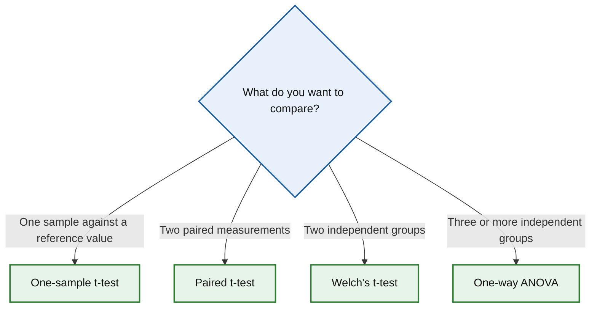

# Choosing the Right Statistical Method

Use the diagram below to identify an appropriate statistical method.

## Available methods

### Comparison of means

- [One-sample t-test](tests/one-sample-t-test.md)  
  Compare a sample mean against a reference value.

- [Paired t-test](tests/paired-t-test.md)  
  Compare the mean difference between two related measurements.

- [Welch's t-test](tests/welch-t-test.md)  
  Compare the means of two independent groups without assuming equal variances.

- [One-way ANOVA](tests/one-way-anova.md)  
  Compare the means of three or more independent groups.

---

*More statistical methods will be added over time, including Two-way ANOVA, non-parametric tests, regression models and assumption checks.*
