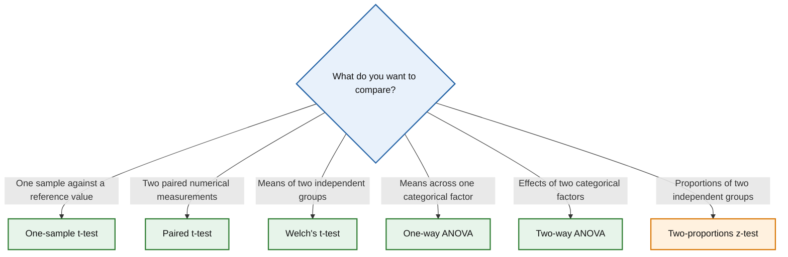

# Choosing the Right Statistical Method

Use the diagram below to identify an appropriate statistical method.

## Available methods

### Comparison of means

- [One-sample t-test](tests/one-sample-t-test.md)  
  Compare a sample mean against a reference value.

- [Paired t-test](tests/paired-t-test.md)  
  Compare the mean difference between two related measurements.

- [Welch's t-test](tests/welch-t-test.md)  
  Compare the means of two independent groups without assuming equal variances.

- [One-way ANOVA](tests/one-way-anova.md)  
  Compare the means of three or more independent groups defined by a single categorical factor.

- [Two-way ANOVA](tests/two-way-anova.md)  
  Evaluate the effects of two categorical factors simultaneously and determine whether they interact.

### Comparison of proportions

- [Two-proportions z-test](tests/two-proportions-z-test.md)  
  Compare the success probabilities of two independent groups.

---

*More statistical methods will be added over time, including assumption checks, non-parametric tests, regression models, categorical data analysis and statistical concepts.*
