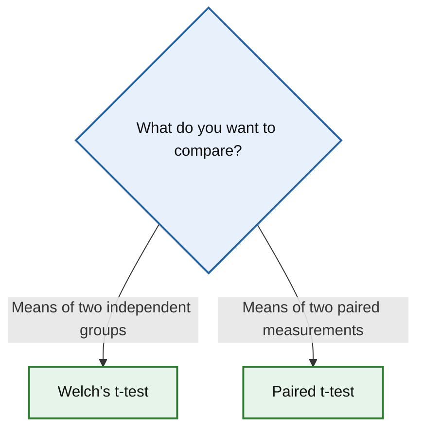

# Choosing the Right Statistical Method

Use the diagram below to identify an appropriate statistical method.

## Available methods

- [Welch's t-test](tests/welch-t-test.md)  
  Compare the means of two independent groups without assuming equal variances.

- [Paired t-test](tests/paired-t-test.md)  
  Compare the mean difference between two related measurements.

