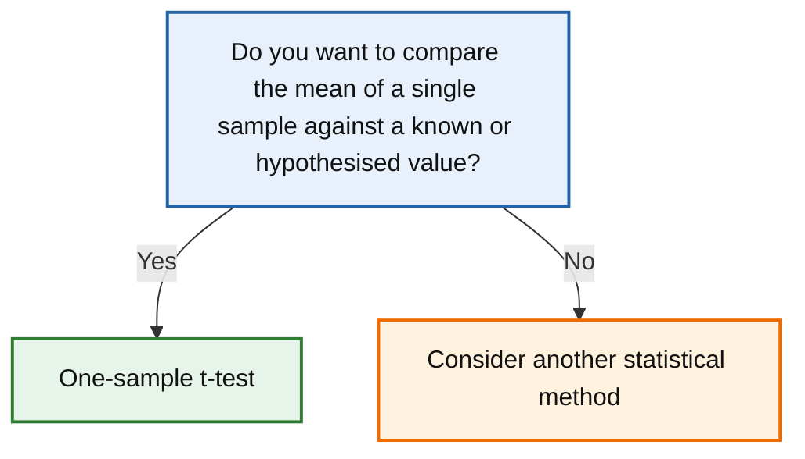

# One-sample t-test

← [Back to statistical method navigator](../index.md)

---



---

# One-sample t-test

## Quick answer

Use a **one-sample t-test** when you want to determine whether the mean of a single sample differs significantly from a known, theoretical or target value.

Typical examples include:

- Is the average exam score different from 70?
- Is the average waiting time greater than 30 minutes?
- Is the average customer satisfaction different from the neutral value of 3?
- Does the average production weight equal the target specification?

The one-sample t-test compares the observed sample mean with a reference value while accounting for sampling variability.

---

# Research question

The one-sample t-test answers questions such as:

> **Is the population mean equal to a specified value?**

Examples:

- Is the average battery life equal to 10 hours?
- Is the mean systolic blood pressure greater than 120 mmHg?
- Is the average response time below 2 seconds?

---

# When should I use a one-sample t-test?

Use this test when:

- you have **one quantitative variable**.
- observations are **independent**.
- you want to compare the sample mean against a known reference value.
- the population standard deviation is unknown.
- the distribution is approximately normal (or the sample size is sufficiently large).

Examples include:

| Scenario | Reference value |
|----------|-----------------|
| Exam scores | 70 points |
| Product weight | 500 g |
| Satisfaction score | 3 (neutral) |
| Waiting time | 30 minutes |

---

# Decision checklist

Use a one-sample t-test if all the following are true:

- ✔ One sample only
- ✔ Numerical outcome
- ✔ Independent observations
- ✔ Comparison against a fixed reference value
- ✔ Mean is the parameter of interest

Otherwise consider another method.

---

# Conceptual idea

Suppose a company claims that a package contains **500 g** of product.

You randomly measure 25 packages and obtain an average of **493 g**.

Is this difference simply due to sampling variation?

Or is the true average actually different from 500 g?

The one-sample t-test quantifies whether the observed difference is larger than would reasonably be expected by chance.

Instead of comparing two groups, this test compares:

- the observed sample mean

against

- a fixed reference value.

---

# Notation

Let

- \(n\) = sample size
- \(\bar{x}\) = sample mean
- \(s\) = sample standard deviation
- \(\mu_0\) = hypothesised population mean

where

\[
\mu_0
\]

is the value specified under the null hypothesis.

---

# Hypotheses

For a two-sided test,

\[
H_0:\mu=\mu_0
\]

\[
H_1:\mu\neq\mu_0
\]

For a one-sided test,

Greater than:

\[
H_1:\mu>\mu_0
\]

Less than:

\[
H_1:\mu<\mu_0
\]

---

# Test statistic

The test statistic is

\[
t=
\frac{\bar{x}-\mu_0}
{s/\sqrt{n}}
\]

where

- numerator = observed difference from the reference value;
- denominator = estimated standard error of the mean.

If the null hypothesis is true,

\[
t
\]

follows a Student's t-distribution with

\[
n-1
\]

degrees of freedom.

---

# Assumptions

The one-sample t-test relies on several assumptions.

## 1. Independent observations

Measurements must be independent.

For example,

✔ different individuals

✔ different products

✘ repeated measurements on the same participant

---

## 2. Quantitative variable

The response variable should be continuous or approximately continuous.

Examples:

- height
- income
- temperature
- blood pressure

---

## 3. Approximate normality

The test assumes that the underlying population is approximately normally distributed.

For small samples this assumption becomes important.

For larger samples, the Central Limit Theorem makes the procedure relatively robust.

Normality can be evaluated using:

- histograms;
- Q–Q plots;
- Shapiro–Wilk test.

---

## 4. No extreme outliers

Large outliers can substantially affect

- the sample mean;
- the standard deviation;
- the resulting t statistic.

Always inspect the data before performing the test.

---

# What if the assumptions are violated?

## Mild departures from normality

The one-sample t-test is generally robust, especially for moderate or large sample sizes.

---

## Severe non-normality

If the sample is very small and strongly non-normal, consider a non-parametric alternative such as the **Wilcoxon signed-rank test**.

---

## Extreme outliers

Investigate whether they result from

- data entry errors;
- measurement problems;
- genuine observations.

Simply removing observations without justification is not recommended.

If outliers represent the population of interest, robust statistical methods may be preferable.

---

# Python implementation

SciPy provides the function `ttest_1samp()` for performing a one-sample t-test.

```python
import scipy.stats as stats

result = stats.ttest_1samp(
    sample,
    popmean=reference_value,
    alternative="two-sided"
)

print(result.statistic)
print(result.pvalue)
```

The returned object also includes:

```python
result.df
```

and, in recent versions of SciPy,

```python
result.confidence_interval()
```

to compute the confidence interval for the population mean.

---

# Worked example

Suppose a manufacturer claims that batteries last **10 hours** on average.

A random sample of 15 batteries produced the following lifetimes:

```python
import numpy as np

battery_life = np.array([
    9.8, 10.4, 10.1, 9.7, 10.0,
    10.5, 9.9, 10.2, 9.8, 10.3,
    9.6, 10.1, 10.0, 9.9, 10.2
])
```

We test

\[
H_0:\mu=10
\]

using

```python
from scipy.stats import ttest_1samp

result = ttest_1samp(
    battery_life,
    popmean=10
)

print(result)
```

Possible output:

```text
TtestResult(
    statistic=0.36,
    pvalue=0.72,
    df=14
)
```

Since

```text
p = 0.72
```

we fail to reject the null hypothesis.

The observed average is compatible with the manufacturer's claim.

---

# Visualising the data

Before performing the test, visualise the observations.

Useful plots include:

- histogram;
- boxplot;
- violin plot;
- Q–Q plot.

These help identify:

- skewness;
- outliers;
- possible departures from normality.

---

# Interpretation

A statistically significant result means that the population mean is unlikely to equal the hypothesised value.

It does **not** indicate whether the observed difference is practically important.

Always report:

- estimated mean;
- confidence interval;
- effect size;
- p-value.

---

# Confidence interval

The confidence interval estimates the plausible range for the true population mean.

Recent SciPy versions provide:

```python
ci = result.confidence_interval()

print(ci.low)
print(ci.high)
```

Example:

```text
95% CI:
9.86 to 10.18 hours
```

Interpretation:

> We are 95% confident that the true mean battery life lies between 9.86 and 10.18 hours.

Notice that if the hypothesised value lies inside the confidence interval, the corresponding two-sided test will generally not be statistically significant at the same confidence level.

---

# Effect size

Statistical significance depends strongly on sample size.

An effect size measures the magnitude of the observed difference.

For a one-sample t-test, the most common measure is **Cohen's d**:

\[
d=
\frac{\bar{x}-\mu_0}{s}
\]

Typical interpretation:

| Cohen's d | Interpretation |
|-----------|---------------|
| 0.20 | Small |
| 0.50 | Medium |
| 0.80 | Large |

These thresholds are only rough guidelines.

Interpretation should always consider the scientific or practical context.

---

# Practical significance

Suppose a sample of 5,000 observations shows that

```text
Mean = 500.3 g
Reference = 500 g
p < 0.001
```

Although statistically significant, a difference of only **0.3 g** may have no practical relevance.

Conversely,

```text
Mean = 492 g
Reference = 500 g
p = 0.06
```

may indicate a substantial practical difference, even if the sample size is too small to achieve statistical significance.

Always distinguish:

- statistical significance;
- practical importance.

---

# Complete reusable implementation

```python
from scipy.stats import ttest_1samp
import numpy as np

def one_sample_t_test(sample, reference_value, alpha=0.05):
    """
    Perform a one-sample t-test.

    Parameters
    ----------
    sample : array-like
        Sample observations.
    reference_value : float
        Hypothesised population mean.
    alpha : float
        Significance level.

    Returns
    -------
    dict
    """

    sample = np.asarray(sample)

    result = ttest_1samp(
        sample,
        popmean=reference_value
    )

    ci = result.confidence_interval()

    return {
        "sample_mean": sample.mean(),
        "reference_mean": reference_value,
        "t_statistic": result.statistic,
        "degrees_of_freedom": result.df,
        "p_value": result.pvalue,
        "confidence_interval": (
            ci.low,
            ci.high
        ),
        "reject_null": result.pvalue < alpha
    }
```

Example:

```python
results = one_sample_t_test(
    battery_life,
    reference_value=10
)

print(results)
```

---

# Reporting template

A typical report could read:

> A one-sample t-test was conducted to determine whether the average battery life differed from 10 hours. The sample mean was 10.02 hours (95% CI [9.86, 10.18]). The difference was not statistically significant, *t*(14) = 0.36, *p* = .72, Cohen's *d* = 0.09.

---

# Common mistakes

## Comparing two groups

The one-sample t-test compares a sample against a fixed value.

If you have two groups, use:

- Welch's t-test;
- Student's t-test.

---

## Ignoring outliers

Outliers may strongly affect

- the sample mean;
- the estimated standard deviation;
- the test result.

Always inspect the data first.

---

## Confusing statistical and practical significance

A tiny difference may become statistically significant with a sufficiently large sample.

Always report an effect size.

---

## Using ordinal data

The one-sample t-test assumes numerical measurements.

Ordinal scales with only a few categories may require different methods.

---

# Comparison with related methods

| Situation | Recommended method |
|-----------|-------------------|
| One sample vs reference value | **One-sample t-test** |
| Two independent groups | Welch's t-test |
| Two paired measurements | Paired t-test |
| Three or more independent groups | One-way ANOVA |
| Non-normal paired or one-sample data | Wilcoxon signed-rank test |

---

# Final decision rule

Use a **one-sample t-test** when:

- you have one sample;
- the response variable is quantitative;
- observations are independent;
- you wish to compare the sample mean against a known reference value;
- the assumptions are reasonably satisfied.

Otherwise consider another statistical method.

---

# Related methods

- Welch's t-test
- Student's t-test
- Paired t-test
- One-way ANOVA
- Wilcoxon signed-rank test

---

# References

- Student. (1908). *The probable error of a mean*. Biometrika, 6(1), 1–25.
- Welch, B. L. (1947). *The generalization of Student's problem when several different population variances are involved*. Biometrika, 34(1–2), 28–35.
- SciPy Developers. *scipy.stats.ttest_1samp*. https://docs.scipy.org/doc/scipy/reference/generated/scipy.stats.ttest_1samp.html
- Field, A. (2018). *Discovering Statistics Using IBM SPSS Statistics* (5th ed.). Sage.
- Montgomery, D. C., & Runger, G. C. (2018). *Applied Statistics and Probability for Engineers* (7th ed.). Wiley.
