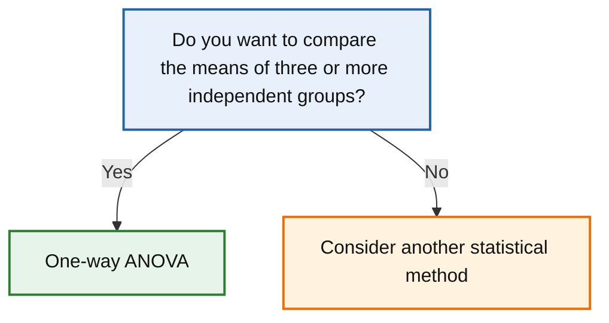

# One-way ANOVA

← [Back to statistical method navigator](../index.md)

---



---

# One-way ANOVA

## Quick answer

Use a **One-way ANOVA** (Analysis of Variance) when you want to determine whether the means of **three or more independent groups** differ significantly.

Typical questions include:

- Do students taught with different teaching methods achieve different average scores?
- Does crop yield depend on the type of fertiliser used?
- Do different treatments produce different recovery times?

Rather than comparing groups two at a time, One-way ANOVA evaluates all groups simultaneously while controlling the overall Type I error rate.

---

# Research question

A One-way ANOVA answers questions such as:

> **Are all population means equal, or does at least one group differ?**

Examples include:

- Do average salaries differ across departments?
- Does average reaction time differ between age groups?
- Is average customer satisfaction the same for all stores?

Notice that ANOVA tells us whether **at least one mean differs**, but not **which groups differ**.

If the ANOVA is statistically significant, a **post-hoc test** (such as Tukey's HSD) is usually performed.

---

# When should I use a One-way ANOVA?

Use this method when:

- the response variable is quantitative;
- observations are independent;
- there is **one categorical explanatory variable (factor)**;
- the factor has **three or more levels**;
- the objective is to compare group means.

Examples:

| Factor | Levels |
|---------|--------|
| Teaching method | Traditional, Online, Hybrid |
| Fertiliser | A, B, C, D |
| Drug treatment | Placebo, Low dose, High dose |

---

# Decision checklist

Use a One-way ANOVA if all the following are true:

- ✔ Quantitative response variable
- ✔ Independent observations
- ✔ One categorical factor
- ✔ Three or more independent groups
- ✔ Comparison of group means

If only two groups are compared, a t-test is generally more appropriate.

---

# Conceptual idea

Suppose three teaching methods are tested.

Their average exam scores are:

| Method | Mean score |
|---------|------------|
| Traditional | 72 |
| Online | 78 |
| Hybrid | 75 |

These averages are not identical.

But are the observed differences simply due to sampling variability?

Or do they reflect genuine differences between teaching methods?

One-way ANOVA answers this question by comparing two sources of variability:

- variability **between groups**;
- variability **within groups**.

If the variability between groups is much larger than the variability within groups, the factor is likely to have a real effect.

---

# Understanding the factor

A **factor** is a categorical variable whose influence on a numerical response is being studied.

Examples:

| Factor | Response |
|---------|----------|
| Teaching method | Exam score |
| Drug treatment | Blood pressure |
| Fertiliser | Crop yield |

The categories of the factor are called **levels**.

For example,

Teaching method

- Traditional
- Online
- Hybrid

contains one factor with three levels.

---

# Notation

Suppose there are

- \(k\) groups;
- \(n_i\) observations in group \(i\);
- \(N\) total observations.

Let

- \(\bar{x}_i\) = mean of group \(i\);
- \(\bar{x}\) = overall (grand) mean.

---

# Hypotheses

The null hypothesis states that every population mean is equal.

\[
H_0:
\mu_1=\mu_2=\cdots=\mu_k
\]

The alternative hypothesis is

\[
H_1:
\text{At least one population mean differs.}
\]

Notice that the alternative hypothesis does **not** specify which group differs.

---

# Test statistic

One-way ANOVA compares

- variation between group means;

with

- variation within groups.

The test statistic is

\[
F=
\frac{\text{Between-group variation}}
{\text{Within-group variation}}
\]

A large value of

\[
F
\]

suggests that group means differ more than expected by chance.

If the null hypothesis is true,

the statistic follows an F distribution with

- numerator degrees of freedom:

\[
k-1
\]

- denominator degrees of freedom:

\[
N-k
\]

---

# Assumptions

One-way ANOVA relies on several assumptions.

## 1. Independent observations

Observations must be independent both within and between groups.

For example,

✔ different students

✔ different patients

✘ repeated measurements on the same participant

---

## 2. Quantitative response variable

The response variable should be continuous or approximately continuous.

Examples include:

- exam score.
- blood pressure.
- income.
- reaction time.

---

## 3. Approximate normality

The response variable should be approximately normally distributed **within each group**.

This assumption becomes more important when sample sizes are small.

Normality can be assessed using:

- histograms.
- Q–Q plots.
- Shapiro–Wilk test.

---

## 4. Homogeneity of variances

The population variances should be approximately equal across groups.

This assumption can be assessed using:

- Levene's test;
- Bartlett's test.

---

# What if the assumptions are violated?

## Mild departures from normality

ANOVA is generally robust when group sizes are moderate and reasonably balanced.

---

## Unequal variances

If variances differ substantially, consider **Welch's ANOVA**, which does not assume equal variances.

---

## Severe non-normality

If assumptions are seriously violated, a non-parametric alternative such as the **Kruskal–Wallis test** may be more appropriate.

---

## Significant ANOVA result

A significant ANOVA indicates that **at least one group differs**, but it does **not** identify which groups are different.

To determine this, perform a suitable post-hoc multiple comparison procedure, such as **Tukey's Honestly Significant Difference (HSD)** test.

---

# Python implementation

SciPy provides the function `f_oneway()` for performing a One-way ANOVA.

```python
from scipy.stats import f_oneway

result = f_oneway(
    group1,
    group2,
    group3
)

print(result.statistic)
print(result.pvalue)
```

The returned object contains:

- the F statistic;
- the p-value.

---

# Worked example

Suppose three teaching methods are evaluated using students' exam scores.

```python
import numpy as np

traditional = np.array([
    72, 75, 71, 73, 74, 70, 76, 72
])

online = np.array([
    80, 79, 82, 81, 83, 78, 80, 81
])

hybrid = np.array([
    75, 77, 74, 76, 75, 78, 74, 76
])
```

We perform the ANOVA:

```python
from scipy.stats import f_oneway

result = f_oneway(
    traditional,
    online,
    hybrid
)

print(result)
```

Possible output:

```text
F_onewayResult(
    statistic=18.42,
    pvalue=0.00003
)
```

Since

```text
p < 0.001
```

we reject the null hypothesis.

There is evidence that at least one teaching method produces a different average score.

---

# Visualising the data

Before performing ANOVA, visualise each group.

Useful plots include:

- boxplots.
- violin plots.
- strip plots.
- histograms.

These help identify:

- skewness.
- outliers.
- unequal variances.

Boxplots are particularly useful because they display:

- medians.
- quartiles.
- spread.
- potential outliers.

---

# Interpretation

A statistically significant ANOVA indicates that **not all population means are equal**.

However,

it does **not** identify which groups differ.

To answer that question, perform a post-hoc multiple comparison procedure.

---

# Post-hoc tests

The most common post-hoc procedure is **Tukey's Honestly Significant Difference (HSD)** test.

Python implementation using `statsmodels`:

```python
from statsmodels.stats.multicomp import pairwise_tukeyhsd

scores = np.concatenate([
    traditional,
    online,
    hybrid
])

groups = (
    ["Traditional"] * len(traditional)
    + ["Online"] * len(online)
    + ["Hybrid"] * len(hybrid)
)

tukey = pairwise_tukeyhsd(
    endog=scores,
    groups=groups,
    alpha=0.05
)

print(tukey)
```

The output identifies which pairs of group means differ significantly while controlling the family-wise Type I error rate.

---

# Effect size

Statistical significance alone does not indicate the magnitude of the observed differences.

For One-way ANOVA, a common effect size is **eta squared**:

\[
\eta^2=
\frac{SS_{Between}}
{SS_{Total}}
\]

where

- \(SS_{Between}\) is the between-group sum of squares;
- \(SS_{Total}\) is the total sum of squares.

Interpretation (rough guidelines):

| η² | Interpretation |
|----|----------------|
| 0.01 | Small |
| 0.06 | Medium |
| 0.14 | Large |

---

# Omega squared

Eta squared tends to overestimate the true population effect.

A less biased estimator is **omega squared**:

\[
\omega^2=
\frac{
SS_{Between}-(k-1)MS_{Within}
}
{
SS_{Total}+MS_{Within}
}
\]

Whenever possible, report **ω²** alongside the ANOVA results.

---

# Practical significance

Suppose an ANOVA produces

```text
F = 6.92

p < 0.001
```

but

```text
η² = 0.02
```

The differences are statistically significant,

yet the factor explains only about 2% of the total variability.

Conversely,

a moderate or large effect size may be practically important even when statistical significance is not achieved because of a small sample.

Always distinguish

- statistical significance.
- practical importance.

---

# Complete reusable implementation

```python
from scipy.stats import f_oneway

def one_way_anova(*groups, alpha=0.05):
    """
    Perform a One-way ANOVA.

    Parameters
    ----------
    *groups
        Two or more independent groups.

    alpha : float
        Significance level.

    Returns
    -------
    dict
    """

    result = f_oneway(*groups)

    return {
        "F_statistic": result.statistic,
        "p_value": result.pvalue,
        "reject_null": result.pvalue < alpha
    }
```

Example:

```python
results = one_way_anova(
    traditional,
    online,
    hybrid
)

print(results)
```

---

# Reporting template

A typical report could read:

> A One-way ANOVA was conducted to compare the mean exam scores across three teaching methods. The analysis revealed a statistically significant effect of teaching method on exam score, *F*(2, 21) = 18.42, *p* < .001, η² = 0.64. Tukey's HSD indicated that the Online method produced significantly higher scores than both the Traditional and Hybrid methods.

---

# Common mistakes

## Performing multiple t-tests

Running several independent t-tests inflates the probability of committing a Type I error.

One-way ANOVA should be used instead.

---

## Ignoring the assumptions

Always assess

- normality;
- homogeneity of variances;
- independence.

---

## Forgetting the post-hoc analysis

A significant ANOVA does not indicate which groups differ.

A suitable post-hoc procedure is required.

---

## Reporting only the p-value

Always report:

- the F statistic.
- degrees of freedom.
- p-value.
- effect size.
- post-hoc results when applicable.

---

# Comparison with related methods

| Situation | Recommended method |
|-----------|-------------------|
| One sample vs reference value | One-sample t-test |
| Two independent groups | Welch's t-test |
| Two paired measurements | Paired t-test |
| Three or more independent groups | **One-way ANOVA** |
| Two categorical factors | Two-way ANOVA |
| Three or more groups with non-normal data | Kruskal–Wallis test |

---

# Final decision rule

Use a **One-way ANOVA** when:

- the response variable is quantitative.
- observations are independent.
- there is one categorical factor.
- the factor has three or more independent groups.
- you wish to compare group means.

If the result is statistically significant,

perform an appropriate post-hoc multiple comparison test.

---

# Related methods

- Welch's t-test
- Student's t-test
- One-sample t-test
- Paired t-test
- Two-way ANOVA
- Kruskal–Wallis test
- Welch's ANOVA

---

# References

- Fisher, R. A. (1925). *Statistical Methods for Research Workers*. Oliver & Boyd.
- Montgomery, D. C. (2020). *Design and Analysis of Experiments* (10th ed.). Wiley.
- Field, A. (2018). *Discovering Statistics Using IBM SPSS Statistics* (5th ed.). Sage.
- SciPy Developers. *scipy.stats.f_oneway*. https://docs.scipy.org/doc/scipy/reference/generated/scipy.stats.f_oneway.html
- Statsmodels Developers. *statsmodels.stats.multicomp.pairwise_tukeyhsd*. https://www.statsmodels.org/
