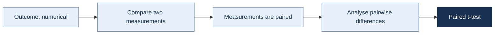

# Paired t-test

[← Return to the statistical test navigator](../index.md)

<div class="decision-path">



</div>

The paired t-test is used when the two observations in each pair belong to the same subject, unit, or matched pair.

---

## Quick answer

Use a **paired t-test** when:

- the outcome is numerical;
- there are two related measurements;
- every observation in one condition has a corresponding observation in the other condition;
- the analysis focuses on the **difference within each pair**;
- those pairwise differences are approximately normally distributed.

Typical examples include:

- measurements taken before and after an intervention;
- scores from the same students under two teaching methods;
- measurements from matched participants;
- two measurements taken from the same experimental unit.

In Python:

```python
from scipy.stats import ttest_rel

result = ttest_rel(before, after)
```

The test evaluates whether the **population mean of the pairwise differences** is equal to zero.

---

## What question does this test answer?

The paired t-test answers questions such as:

> Is the average change between two related measurements different from zero?

For example:

- Did students' scores change after completing a course?
- Did blood pressure change after treatment?
- Did task completion time differ between two interface designs tested by the same users?
- Did the same machines produce different measurements before and after calibration?

The test does **not** compare two independent groups.

Its unit of analysis is the pair:

\[
d_i = x_{1i} - x_{2i}
\]

where \(d_i\) is the difference for pair \(i\).

The paired t-test is therefore mathematically equivalent to applying a **one-sample t-test to the pairwise differences**.

---

## When to use it

Use a paired t-test when all of the following conditions are satisfied:

- The dependent variable is numerical.
- There are exactly two conditions or measurement occasions.
- The observations can be matched one-to-one.
- Each pair is independent of every other pair.
- The pairwise differences are reasonably compatible with a normal distribution.
- The mean difference is the quantity you want to estimate and test.

Common paired designs include:

### Repeated measurements

The same subjects are measured twice.

Examples:

- before and after treatment;
- baseline and follow-up;
- performance under condition A and condition B.

### Matched-pair designs

Different subjects or units are deliberately matched.

Examples:

- participants matched by age and baseline score;
- twins assigned to different treatments;
- stores matched by size and location.

In matched designs, the quality of the pairing should be justified by the study design rather than created arbitrarily after observing the outcome.

---

## Decision checklist

Before using the test, confirm the following:

- [ ] The outcome variable is numerical.
- [ ] There are exactly two measurements or conditions.
- [ ] Each observation has one valid partner.
- [ ] The order of the pairs is aligned correctly.
- [ ] Different pairs are independent.
- [ ] The pairwise differences contain no severe unexplained outliers.
- [ ] The differences are approximately normally distributed, especially when the number of pairs is small.
- [ ] The mean difference is scientifically meaningful.
- [ ] A one-sided alternative, when used, was chosen before inspecting the results.

If the observations cannot be paired one-to-one, use an independent-samples method instead.

---

## Paired versus independent data

The distinction between paired and independent data is determined by the **study design**, not by whether the two samples happen to have the same size.

### Paired data

```text
Student 1: before ↔ after
Student 2: before ↔ after
Student 3: before ↔ after
```

Each value in the first condition has a specific partner in the second condition.

### Independent data

```text
Group A: different participants
Group B: different participants
```

There is no meaningful one-to-one correspondence between observations.

Two independent groups do not become paired merely because both groups contain the same number of observations.

---

## Notation

Let:

- \(n\) be the number of complete pairs;
- \(x_{1i}\) be the first measurement for pair \(i\);
- \(x_{2i}\) be the second measurement for pair \(i\);
- \(d_i = x_{1i} - x_{2i}\) be the difference for pair \(i\);
- \(\bar{d}\) be the sample mean of the differences;
- \(s_d\) be the sample standard deviation of the differences;
- \(\mu_d\) be the population mean difference.

The sample mean difference is:

\[
\bar{d}
=
\frac{1}{n}
\sum_{i=1}^{n} d_i
\]

The sample standard deviation of the differences is:

\[
s_d
=
\sqrt{
\frac{
\sum_{i=1}^{n}(d_i-\bar{d})^2
}{
n-1
}
}
\]

The direction of the difference must be defined consistently.

For example, if:

\[
d_i = \text{after}_i - \text{before}_i
\]

then a positive mean difference represents an average increase.

If the subtraction order is reversed, the sign of the mean difference and the t-statistic will also be reversed.

---

## Null and alternative hypotheses

The null hypothesis states that the population mean difference is zero:

\[
H_0:\mu_d = 0
\]

### Two-sided alternative

Use this when a difference in either direction is relevant:

\[
H_1:\mu_d \neq 0
\]

```python
result = ttest_rel(
    first_measurement,
    second_measurement,
    alternative="two-sided"
)
```

### Greater-than alternative

When the differences are defined as:

\[
d_i = x_{1i} - x_{2i}
\]

the alternative is:

\[
H_1:\mu_d > 0
\]

```python
result = ttest_rel(
    first_measurement,
    second_measurement,
    alternative="greater"
)
```

### Less-than alternative

\[
H_1:\mu_d < 0
\]

```python
result = ttest_rel(
    first_measurement,
    second_measurement,
    alternative="less"
)
```

A one-sided alternative should be selected from the research question before inspecting the sample results.

---

## Test statistic

The paired t-statistic is:

\[
t
=
\frac{
\bar{d} - \mu_{d,0}
}{
s_d / \sqrt{n}
}
\]

Under the usual null hypothesis:

\[
\mu_{d,0}=0
\]

so:

\[
t
=
\frac{
\bar{d}
}{
s_d / \sqrt{n}
}
\]

The standard error of the mean difference is:

\[
SE_{\bar{d}}
=
\frac{s_d}{\sqrt{n}}
\]

The degrees of freedom are:

\[
df = n - 1
\]

A large absolute value of \(t\) indicates that the observed mean difference is large relative to its estimated standard error.

The sign of \(t\) depends on the subtraction order:

\[
d_i = x_{1i} - x_{2i}
\]

A positive statistic means that the first measurement is larger on average. A negative statistic means that the second measurement is larger on average.

---

## Assumptions

### 1. Numerical outcome

The dependent variable should be measured on a numerical scale for which means and differences are meaningful.

Examples include:

- time;
- distance;
- temperature;
- revenue;
- test scores;
- blood pressure.

---

### 2. Correct pairing

Every value in the first condition must correspond to the correct value in the second condition.

For example:

```text
before[0] ↔ after[0]
before[1] ↔ after[1]
before[2] ↔ after[2]
```

A sorting or merging error can create incorrect pairs and invalidate the analysis.

Pair identifiers should therefore be checked explicitly whenever the data originate from separate tables or files.

---

### 3. Independence between pairs

The observations inside each pair are intentionally dependent.

However, one pair should be independent of every other pair.

For example, the measurements from participant 1 should not determine the measurements from participant 2.

Dependence between pairs may arise from:

- repeated observations nested within teams;
- participants from the same household;
- students within the same classroom;
- measurements clustered by location;
- multiple pairs contributed by the same subject.

Such structures may require a mixed-effects model or another method that explicitly represents clustering.

---

### 4. Approximate normality of the differences

The normality assumption applies to:

\[
d_i = x_{1i} - x_{2i}
\]

It does **not** require each measurement separately to be normally distributed.

To inspect the assumption, calculate the pairwise differences and examine:

- a histogram;
- a Q–Q plot;
- extreme observations;
- the context and measurement process.

Example:

```python
import matplotlib.pyplot as plt
from scipy.stats import probplot

differences = after - before

plt.hist(differences)
plt.xlabel("Pairwise difference")
plt.ylabel("Frequency")
plt.show()

probplot(differences, dist="norm", plot=plt)
plt.show()
```

With a moderate or large number of pairs, the paired t-test is often reasonably robust to mild non-normality.

With a small sample, strong skewness or extreme outliers can substantially affect the result.

A normality test should not be used as an automatic switch that decides whether the paired t-test is allowed. Graphical inspection, sample size, study design, and the severity of deviations should also be considered.

---

### 5. No severe unexplained outliers in the differences

An unusual value in one condition is not necessarily problematic by itself.

What matters directly to the paired t-test is whether the corresponding difference is unusually extreme.

Inspect the differences:

```python
import matplotlib.pyplot as plt

differences = after - before

plt.boxplot(differences)
plt.ylabel("Pairwise difference")
plt.show()
```

Do not delete an outlier solely because it affects statistical significance.

Instead:

1. verify whether it is a data-entry or measurement error;
2. investigate whether it represents a legitimate observation;
3. report any exclusion transparently;
4. consider a sensitivity analysis.

---

## What if the assumptions fail?

### The observations are independent rather than paired

Use an independent-samples test:

- Welch's t-test when comparing means;
- Student's independent t-test only when equal variances are defensible;
- Mann–Whitney U for an appropriate rank-based comparison;
- an independent-samples permutation test.

---

### There are more than two repeated measurements

A paired t-test is not sufficient.

Consider:

- repeated-measures ANOVA;
- a linear mixed-effects model;
- the Friedman test for a rank-based repeated-measures analysis.

Running many paired t-tests increases the risk of false-positive conclusions unless multiplicity is addressed.

---

### The differences are strongly non-normal

Possible alternatives include:

- the Wilcoxon signed-rank test;
- a sign test;
- a paired permutation test;
- a bootstrap confidence interval for the mean difference.

These methods answer related but not always identical questions.

The Wilcoxon signed-rank test is not simply a universal non-parametric replacement for a test of the mean. Its interpretation is based on the distribution and ranks of paired differences and involves additional assumptions, including a suitable form of symmetry for its usual location interpretation.

If the scientific target remains the **mean difference**, a paired permutation procedure or bootstrap interval may align more directly with that target.

---

### The differences contain influential outliers

Consider:

- correcting confirmed data errors;
- reporting analyses with and without the observation;
- using a robust location estimator;
- applying a robust paired method;
- using a rank-based or permutation procedure when appropriate.

The final choice should reflect the research question, not only which method produces the smallest p-value.

---

### Some pairs are incomplete

The standard paired t-test uses complete pairs.

Do not independently remove missing values from the two arrays, because doing so may misalign the observations.

Instead, remove or select observations using a shared mask:

```python
import numpy as np

complete = ~np.isnan(before) & ~np.isnan(after)

before_complete = before[complete]
after_complete = after[complete]
```

If missingness is substantial or plausibly informative, complete-case analysis may be biased. A mixed-effects model or a principled missing-data method may be more appropriate.

---

## Python implementation

### Basic two-sided test

```python
from scipy.stats import ttest_rel

result = ttest_rel(before, after)

print(f"t-statistic: {result.statistic:.3f}")
print(f"p-value: {result.pvalue:.4f}")
print(f"degrees of freedom: {result.df:.0f}")
```

---

### Explicit alternative hypothesis

```python
from scipy.stats import ttest_rel

result = ttest_rel(
    before,
    after,
    alternative="two-sided"
)
```

Available alternatives are:

```python
alternative="two-sided"
alternative="greater"
alternative="less"
```

Remember that SciPy calculates the statistic from the first input minus the second input:

```text
before - after
```

Therefore:

```python
ttest_rel(before, after, alternative="greater")
```

tests whether `before` is greater than `after` on average.

To test whether the values increased from before to after, either use:

```python
ttest_rel(after, before, alternative="greater")
```

or equivalently:

```python
ttest_rel(before, after, alternative="less")
```

Choose one convention and document it clearly.

---

### Handling missing values

```python
result = ttest_rel(
    before,
    after,
    nan_policy="omit"
)
```

Although `nan_policy="omit"` can be convenient, it is still important to verify:

- how many complete pairs remain;
- why values are missing;
- whether missingness could bias the result.

A more explicit workflow is often easier to audit:

```python
import numpy as np
from scipy.stats import ttest_rel

complete = ~np.isnan(before) & ~np.isnan(after)

before_complete = before[complete]
after_complete = after[complete]

result = ttest_rel(before_complete, after_complete)

print(f"Complete pairs: {len(before_complete)}")
print(f"t({result.df:.0f}) = {result.statistic:.3f}")
print(f"p = {result.pvalue:.4f}")
```

---

## Worked example

Suppose an instructor measures the time, in minutes, required by the same students to complete a task before and after a training session.

```python
import numpy as np
from scipy.stats import ttest_rel

before = np.array([
    42, 38, 45, 41, 39,
    47, 44, 40, 43, 46,
    37, 48
])

after = np.array([
    38, 36, 41, 39, 35,
    43, 40, 37, 41, 42,
    35, 44
])

result = ttest_rel(before, after)

differences = before - after

print(f"Number of pairs: {len(differences)}")
print(f"Mean before: {before.mean():.2f}")
print(f"Mean after: {after.mean():.2f}")
print(f"Mean difference: {differences.mean():.2f}")
print(f"SD of differences: {differences.std(ddof=1):.2f}")
print(f"t-statistic: {result.statistic:.3f}")
print(f"Degrees of freedom: {result.df:.0f}")
print(f"p-value: {result.pvalue:.4f}")
```

Here the differences are defined as:

\[
d_i = \text{before}_i - \text{after}_i
\]

A positive mean difference therefore indicates that completion times were lower after training.

---

## Inspecting the paired data

Summary statistics for each condition are useful, but they do not show the within-pair structure.

A paired plot makes that structure visible:

```python
import matplotlib.pyplot as plt

for before_value, after_value in zip(before, after):
    plt.plot(
        ["Before", "After"],
        [before_value, after_value],
        marker="o"
    )

plt.ylabel("Completion time (minutes)")
plt.show()
```

It is also useful to plot the differences directly:

```python
differences = before - after

plt.axhline(0, linewidth=1)
plt.scatter(
    np.arange(1, len(differences) + 1),
    differences
)

plt.xlabel("Pair")
plt.ylabel("Before − after")
plt.show()
```

These plots can reveal:

- the direction of change;
- variation between pairs;
- unusual differences;
- subjects whose response differs from the general pattern.

---

## Interpretation

Choose a significance level before analysing the data.

A common choice is:

\[
\alpha = 0.05
\]

### When \(p < \alpha\)

Reject the null hypothesis.

The data provide evidence that the population mean difference is not zero, or is in the direction specified by a justified one-sided alternative.

### When \(p \geq \alpha\)

Do not reject the null hypothesis.

The data do not provide sufficient evidence of a non-zero mean difference at the selected significance level.

This does **not** prove that:

\[
\mu_d = 0
\]

A non-significant result may reflect:

- a genuinely small difference;
- high variability in the differences;
- too few pairs;
- imprecise measurement;
- an interval of plausible effects that includes both meaningful and negligible values.

Always interpret the p-value together with:

- the estimated mean difference;
- its confidence interval;
- the sample size;
- the variability of the differences;
- the practical relevance of the effect.

---

## Confidence interval

A confidence interval estimates a range of plausible values for the population mean difference.

Using SciPy:

```python
result = ttest_rel(before, after)

ci = result.confidence_interval(confidence_level=0.95)

print(f"95% CI: [{ci.low:.2f}, {ci.high:.2f}]")
```

The confidence interval corresponds to the subtraction order used by SciPy:

```text
before - after
```

A positive interval therefore indicates that the first measurement is larger on average.

The confidence interval can also be calculated manually:

```python
import numpy as np
from scipy.stats import t

differences = before - after

n = len(differences)
mean_difference = differences.mean()
sd_difference = differences.std(ddof=1)
standard_error = sd_difference / np.sqrt(n)

critical_value = t.ppf(0.975, df=n - 1)

lower = mean_difference - critical_value * standard_error
upper = mean_difference + critical_value * standard_error

print(f"95% CI: [{lower:.2f}, {upper:.2f}]")
```

The general formula is:

\[
\bar{d}
\pm
t_{1-\alpha/2,\ n-1}
\frac{s_d}{\sqrt{n}}
\]

### Interpreting the interval

If a 95% confidence interval for the mean difference is:

\[
[2.1,\ 5.4]
\]

then positive mean differences within that range are compatible with the data and model assumptions.

If the interval includes zero, the corresponding two-sided test will not reject the null hypothesis at:

\[
\alpha = 0.05
\]

The width of the interval communicates precision. A narrow interval indicates a more precise estimate than a wide interval.

---

## Effect size

Statistical significance does not indicate whether the observed change is practically important.

A common standardized effect size for paired data is **Cohen's \(d_z\)**:

\[
d_z
=
\frac{\bar{d}}{s_d}
\]

where:

- \(\bar{d}\) is the mean pairwise difference;
- \(s_d\) is the standard deviation of the pairwise differences.

Python implementation:

```python
differences = before - after

mean_difference = differences.mean()
sd_difference = differences.std(ddof=1)

cohens_dz = mean_difference / sd_difference

print(f"Cohen's dz: {cohens_dz:.3f}")
```

Because:

\[
t
=
\frac{\bar{d}}{s_d/\sqrt{n}}
\]

Cohen's \(d_z\) can also be written as:

\[
d_z = \frac{t}{\sqrt{n}}
\]

```python
cohens_dz = result.statistic / np.sqrt(len(differences))
```

The sign reflects the direction of subtraction.

The magnitude should be interpreted in the context of the field, measurement scale, study design, and consequences of the effect.

Rules of thumb such as small, medium, and large should not replace domain-specific interpretation.

### Raw effect versus standardized effect

Whenever possible, report both:

1. the raw mean difference in the original measurement units;
2. a standardized effect size when it adds useful context.

For example:

```text
The mean completion time decreased by 3.8 minutes
(Cohen's dz = 1.12).
```

The raw difference is usually easier to interpret operationally.

---

## Practical significance

A statistically detectable difference may still be too small to matter.

Before analysing the data, consider defining a minimum important difference:

\[
\Delta_{\text{important}}
\]

Then compare the confidence interval with that threshold.

For example:

- an interval entirely beyond the important threshold supports a meaningful effect;
- an interval entirely inside a negligible region supports a practically small effect;
- a wide interval spanning both regions indicates uncertainty.

A conventional hypothesis test against zero cannot, by itself, establish equivalence or practical irrelevance.

When the objective is to show that differences are sufficiently small, consider an equivalence test such as the two one-sided tests procedure.

---

## Complete reusable implementation

```python
import numpy as np
from scipy.stats import ttest_rel


def paired_t_test(
    first,
    second,
    *,
    alternative="two-sided",
    confidence_level=0.95
):
    """
    Run a paired t-test and return descriptive and inferential results.

    Parameters
    ----------
    first, second : array-like
        Paired numerical observations.
    alternative : {"two-sided", "less", "greater"}
        Alternative hypothesis for first - second.
    confidence_level : float
        Confidence level for the mean difference interval.

    Returns
    -------
    dict
        Test results and descriptive statistics.
    """

    first = np.asarray(first, dtype=float)
    second = np.asarray(second, dtype=float)

    if first.shape != second.shape:
        raise ValueError(
            "The paired samples must have the same shape."
        )

    complete = ~np.isnan(first) & ~np.isnan(second)

    first_complete = first[complete]
    second_complete = second[complete]

    if len(first_complete) < 2:
        raise ValueError(
            "At least two complete pairs are required."
        )

    differences = first_complete - second_complete

    if np.isclose(differences.std(ddof=1), 0):
        raise ValueError(
            "The differences have zero or near-zero variability."
        )

    result = ttest_rel(
        first_complete,
        second_complete,
        alternative=alternative
    )

    confidence_interval = result.confidence_interval(
        confidence_level=confidence_level
    )

    mean_difference = differences.mean()
    sd_difference = differences.std(ddof=1)
    standard_error = sd_difference / np.sqrt(len(differences))
    cohens_dz = mean_difference / sd_difference

    return {
        "n_pairs": len(differences),
        "mean_first": first_complete.mean(),
        "mean_second": second_complete.mean(),
        "mean_difference": mean_difference,
        "sd_difference": sd_difference,
        "standard_error": standard_error,
        "t_statistic": result.statistic,
        "degrees_of_freedom": result.df,
        "p_value": result.pvalue,
        "confidence_level": confidence_level,
        "ci_low": confidence_interval.low,
        "ci_high": confidence_interval.high,
        "cohens_dz": cohens_dz,
        "alternative": alternative,
    }
```

Example:

```python
results = paired_t_test(before, after)

for name, value in results.items():
    print(f"{name}: {value}")
```

---

## What to report

A complete report should normally include:

- the number of complete pairs;
- descriptive statistics for both conditions;
- the mean pairwise difference;
- the standard deviation of the differences;
- the t-statistic;
- the degrees of freedom;
- the p-value;
- a confidence interval for the mean difference;
- an effect size;
- the direction used to calculate the differences.

### Reporting template

> A paired-samples t-test was conducted to compare [outcome] between [condition 1] and [condition 2]. The mean difference, calculated as [condition 1 − condition 2], was \(M_d =\) [value] ([confidence level]% CI [[lower], [upper]]). The difference was [statistically significant / not statistically significant], \(t([df]) =\) [value], \(p =\) [value], \(d_z =\) [value].

### Example report

> A paired-samples t-test was conducted to compare task completion time before and after training. Completion time was lower after training. The mean difference, calculated as before minus after, was 3.75 minutes (95% CI [3.20, 4.30]). The difference was statistically significant, \(t(11) = 15.02\), \(p < .001\), \(d_z = 4.34\).

Use values calculated from the actual dataset rather than copying the numbers in this example.

---

## Common mistakes

### Treating paired observations as independent

Using an independent-samples test ignores the within-pair relationship and may produce an inappropriate standard error.

Use:

```python
ttest_rel(before, after)
```

not:

```python
ttest_ind(before, after)
```

when the observations are genuinely paired.

---

### Treating independent observations as paired

Equal sample sizes do not establish pairing.

A valid pair must be defined by the design or data-generating process.

---

### Misaligning the rows

This is one of the most serious practical errors.

For example, sorting the `before` table but not the `after` table can associate measurements from different subjects.

Prefer an explicit merge on a unique identifier:

```python
paired = before_df.merge(
    after_df,
    on="participant_id",
    how="inner",
    validate="one_to_one"
)
```

Then inspect the number of matched and unmatched records.

---

### Testing normality separately in each condition

The relevant assumption concerns:

\[
d_i = x_{1i} - x_{2i}
\]

not the marginal distributions of `before` and `after`.

---

### Ignoring the subtraction direction

These calls produce statistics with opposite signs:

```python
ttest_rel(before, after)
ttest_rel(after, before)
```

For a two-sided test, the p-values are the same, but the interpretation of the sign and confidence interval changes.

---

### Using a one-sided test after seeing the data

The direction should be specified in advance.

Selecting a one-sided alternative because the observed effect points in a preferred direction invalidates the intended error rate.

---

### Interpreting non-significance as proof of no change

A large p-value means that the data do not provide strong enough evidence against the null hypothesis.

It does not demonstrate exact equality.

Inspect the confidence interval to determine which effect sizes remain plausible.

---

### Reporting only the p-value

The p-value does not communicate:

- the estimated change;
- its units;
- its precision;
- its practical relevance.

Report the mean difference and confidence interval.

---

### Removing incomplete observations independently

This can destroy the pairing.

Use one shared complete-case mask or merge observations by identifier.

---

### Applying multiple paired t-tests without adjustment

Testing many outcomes, time points, or subgroup comparisons increases the chance of false-positive findings.

Consider:

- a multiplicity adjustment;
- a repeated-measures model;
- a multilevel model;
- a clearly defined primary outcome.

---

### Assuming the paired t-test tests individual improvement

The test evaluates the **average difference**.

A significant positive average does not imply that every participant improved.

Inspect individual trajectories to understand response heterogeneity.

---

## Paired t-test versus related methods

| Research design or objective | Possible method |
|---|---|
| One numerical sample compared with a fixed value | One-sample t-test |
| Two related numerical measurements | Paired t-test |
| Two independent numerical groups | Welch's t-test |
| Two paired measurements with a suitable rank-based question | Wilcoxon signed-rank test |
| Two paired measurements analysed by signs only | Sign test |
| More than two repeated numerical measurements | Repeated-measures ANOVA |
| Repeated observations with missingness or complex clustering | Mixed-effects model |
| Test the mean difference with minimal distributional assumptions | Paired permutation test |
| Estimate uncertainty for the mean or another statistic | Bootstrap interval |
| Show that differences are practically negligible | Equivalence test |

---

## Relationship with the one-sample t-test

The paired t-test can be reduced to three steps:

### Step 1: calculate the differences

```python
differences = before - after
```

### Step 2: test whether their mean is zero

```python
from scipy.stats import ttest_1samp

one_sample_result = ttest_1samp(
    differences,
    popmean=0
)
```

### Step 3: compare with the paired test

```python
paired_result = ttest_rel(before, after)

print(one_sample_result.statistic)
print(paired_result.statistic)

print(one_sample_result.pvalue)
print(paired_result.pvalue)
```

Apart from numerical rounding, the results should match.

This equivalence explains why:

- normality is assessed on the differences;
- the degrees of freedom are \(n-1\);
- the analysis depends on the variability of the differences;
- the mean difference is the central estimand.

---

## Final decision rule

Use the paired t-test when the analytical path is:

```text
Numerical outcome
        ↓
Two measurements or conditions
        ↓
Observations are paired
        ↓
Mean difference is the target
        ↓
Differences are reasonably compatible with normality
        ↓
Paired t-test
```

Do not select the test merely because the two arrays have equal lengths.

The pairing must have a substantive meaning.

---

## Related methods

- [Welch's t-test](welch-t-test.md)
- One-sample t-test
- Student's independent two-sample t-test
- Wilcoxon signed-rank test
- Sign test
- Paired permutation test
- Repeated-measures ANOVA
- Linear mixed-effects models
- Equivalence testing

> Some links may remain inactive until the corresponding pages are added to the handbook.

---

## References

- SciPy documentation: `scipy.stats.ttest_rel`
- Student. *The probable error of a mean*. Biometrika, 1908.
- Standard introductory texts on paired-samples inference and repeated-measures designs.

---

[← Return to the statistical test navigator](../index.md)
