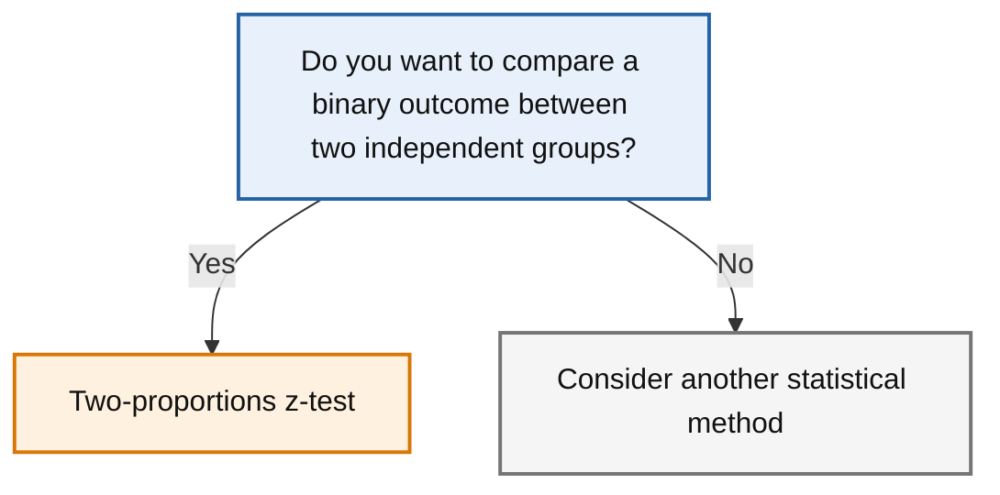

# Two-proportions z-test

← [Back to statistical method navigator](../index.md)

---



---

## Quick answer

Use a **two-proportions z-test** when you want to compare the probability of a binary outcome between two independent groups.

Typical binary outcomes include:

- completed / did not complete
- converted / did not convert
- clicked / did not click
- error / no error
- recovered / did not recover

For example:

> Is the completion rate different between the Control and Test versions of a website?

The test compares two population proportions:

\[
p_1
\]

and

\[
p_2
\]

where each proportion represents the probability of success in one group.

---

## What question does this test answer?

The two-proportions z-test answers questions such as:

> Is the probability of success different between two independent groups?

Examples include:

- Is the completion rate different between the Control and Test groups?
- Is the conversion rate higher for version B than for version A?
- Is the error rate lower after introducing a new interface?
- Is the recovery rate different between two independent treatments?

The outcome must be defined as a binary event.

For example, in an A/B test:

```text
Success = user completed the process
Failure = user did not complete the process
```

The proportion in each group is then:

\[
\hat{p}_1 = \frac{x_1}{n_1}
\]

\[
\hat{p}_2 = \frac{x_2}{n_2}
\]

where:

- \(x_1\) and \(x_2\) are the numbers of successes
- \(n_1\) and \(n_2\) are the group sample sizes

---

## When to use it

Use a two-proportions z-test when:

- the outcome is binary
- there are exactly two groups
- the groups are independent
- every observation belongs to only one group
- each observation represents one Bernoulli outcome
- the samples are large enough for the normal approximation to be reasonable
- the target is a difference between two population proportions

Typical data can be represented as:

| Group | Successes | Failures | Total |
|-------|----------:|---------:|------:|
| Control | \(x_1\) | \(n_1-x_1\) | \(n_1\) |
| Test | \(x_2\) | \(n_2-x_2\) | \(n_2\) |

---

## Decision checklist

Before using the test, check the following:

- [ ] The outcome has exactly two relevant states.
- [ ] A success has been defined clearly before analysing the data.
- [ ] There are two independent groups.
- [ ] Each unit contributes only one independent outcome.
- [ ] The numbers of successes and failures are sufficiently large.
- [ ] The group assignment or sampling process is appropriate.
- [ ] A one-sided or two-sided hypothesis was chosen before inspecting the result.
- [ ] The practical importance of the difference has been defined.

If the same subjects are measured twice, the observations are paired and a method such as **McNemar's test** may be more appropriate.

If expected counts are very small, consider **Fisher's exact test**.

---

## Binary outcome versus numerical outcome

A proportion is based on a binary variable.

For example:

```text
completed = 1
not completed = 0
```

The sample mean of this binary variable is exactly the sample proportion:

\[
\bar{x}
=
\frac{\text{number of successes}}{\text{number of observations}}
=
\hat{p}
\]

This explains why a z-test for proportions can be interpreted as a test comparing the means of two binary variables.

However, the outcome should still be described as a **proportion**, **probability**, **risk** or **rate**, depending on the context.

---

## Defining success carefully

The meaning of the test depends entirely on how success is defined.

For example, an error rate might mean:

1. the proportion of sessions that do not reach completion
2. the proportion of sessions containing at least one backward step
3. the proportion of all navigation events that are backward steps

These are different estimands and may require different denominators.

Before calculating the test, specify:

- the observational unit
- the success event
- the denominator
- whether repeated observations from the same user are treated as independent.

!!! warning "The denominator is part of the definition"

    A proportion is not defined only by its numerator.

    For example:

    \[
    \text{error rate}
    =
    \frac{\text{sessions with at least one error}}
    {\text{all sessions}}
    \]

    answers a different question from:

    \[
    \text{error rate}
    =
    \frac{\text{backward transitions}}
    {\text{all transitions}}
    \]

---

## Notation

Let:

- \(x_1\) be the number of successes in group 1
- \(x_2\) be the number of successes in group 2
- \(n_1\) be the number of observations in group 1
- \(n_2\) be the number of observations in group 2
- \(p_1\) be the population success probability in group 1
- \(p_2\) be the population success probability in group 2

The observed sample proportions are:

\[
\hat{p}_1
=
\frac{x_1}{n_1}
\]

\[
\hat{p}_2
=
\frac{x_2}{n_2}
\]

Define the population proportion difference as:

\[
\Delta_p = p_1-p_2
\]

and the observed risk difference as:

\[
\widehat{\Delta}_p
=
\hat{p}_1-\hat{p}_2
\]

The sign depends on the order of the groups.

For example, if group 1 is Test and group 2 is Control:

\[
\hat{p}_{Test}-\hat{p}_{Control}>0
\]

indicates a higher observed success proportion in the Test group.

---

## Null and alternative hypotheses

### Two-sided test

Use a two-sided test when a difference in either direction matters.

\[
H_0:p_1=p_2
\]

\[
H_1:p_1\neq p_2
\]

Equivalently:

\[
H_0:p_1-p_2=0
\]

\[
H_1:p_1-p_2\neq0
\]

In `statsmodels`:

```python
alternative="two-sided"
```

---

### One-sided test: group 1 has a larger proportion

Use this only when the direction was defined before inspecting the data.

\[
H_0:p_1\leq p_2
\]

\[
H_1:p_1>p_2
\]

In `statsmodels`:

```python
alternative="larger"
```

---

### One-sided test: group 1 has a smaller proportion

\[
H_0:p_1\geq p_2
\]

\[
H_1:p_1<p_2
\]

In `statsmodels`:

```python
alternative="smaller"
```

!!! warning "Group order matters"

    In a two-sample test:

    ```python
    alternative="larger"
    ```

    tests whether the proportion of the **first** sample is larger than
    the proportion of the second sample.

    Reversing the order of the groups reverses the sign of the z-statistic
    and changes the interpretation of a one-sided test.

---

## Test statistic

Under the null hypothesis of equal population proportions, the two samples are used to estimate a pooled proportion:

\[
\hat{p}
=
\frac{x_1+x_2}
{n_1+n_2}
\]

The estimated standard error under the null hypothesis is:

\[
SE_0
=
\sqrt{
\hat{p}(1-\hat{p})
\left(
\frac{1}{n_1}
+
\frac{1}{n_2}
\right)
}
\]

The z-statistic is:

\[
z
=
\frac{
\hat{p}_1-\hat{p}_2
}{
SE_0
}
\]

or, written fully:

\[
z
=
\frac{
\hat{p}_1-\hat{p}_2
}{
\sqrt{
\hat{p}(1-\hat{p})
\left(
\frac{1}{n_1}
+
\frac{1}{n_2}
\right)
}
}
\]

Under the null hypothesis and when the normal approximation is reasonable:

\[
z \sim N(0,1)
\]

A positive z-statistic indicates:

\[
\hat{p}_1>\hat{p}_2
\]

A negative z-statistic indicates:

\[
\hat{p}_1<\hat{p}_2
\]

The absolute magnitude of \(z\) measures how far the observed difference is from zero in estimated standard-error units.

---

## Why is the proportion pooled?

The classical test assumes under the null hypothesis that:

\[
p_1=p_2
\]

Therefore, both samples are treated as observations from populations sharing one common success probability.

That common probability is estimated using:

\[
\hat{p}
=
\frac{x_1+x_2}{n_1+n_2}
\]

The pooled estimate is used only for calculating the standard error of the hypothesis test under the equality null hypothesis.

For an interval estimating the actual difference:

\[
p_1-p_2
\]

the standard error and interval construction need not use the same pooled formula.

---

## Assumptions

### 1. Binary outcome

Every observation must be classified into one of two states.

Examples:

- success / failure
- complete / incomplete
- error / no error

The categories should be:

- mutually exclusive
- collectively exhaustive
- defined consistently across groups

---

### 2. Independent groups

The two groups must be independent.

For example:

```text
Control users ≠ Test users
```

A user should not normally contribute observations to both groups.

If the same units are observed under both conditions, the data are paired rather than independent.

---

### 3. Independence within groups

Each observation should be independent from the others.

This assumption may be violated when:

- one user contributes several sessions
- users belong to the same household or organisation
- observations are clustered by store, class or country
- the same device generates repeated outcomes

In such cases, the effective amount of independent information may be smaller than the raw row count.

A clustered model, mixed-effects model or analysis at the appropriate unit level may be required.

---

### 4. Normal approximation

The z-test uses a normal approximation to the sampling distribution of the difference between proportions.

This approximation becomes questionable when the expected numbers of successes or failures are very small.

A common rule of thumb is to require sufficiently many expected successes and failures in both groups. The threshold should not be treated as an absolute law; the adequacy of the approximation depends on sample size, balance and how close the proportions are to zero or one.

Inspect at least:

\[
n_1\hat{p}
\]

\[
n_1(1-\hat{p})
\]

\[
n_2\hat{p}
\]

\[
n_2(1-\hat{p})
\]

where \(\hat{p}\) is the pooled proportion under the null.

For a detailed explanation of how null and alternative hypotheses should
be formulated, see
[Statistical hypotheses](../concepts/hypotheses.md).

---

### 5. Representative sampling or valid assignment

Statistical inference requires a defensible connection between the observed groups and the target populations.

In an A/B experiment, random assignment supports a causal interpretation of the difference between variants.

Without random assignment, the test may detect an association between group membership and outcome, but confounding variables may explain the difference.

---

## What if the assumptions are not met?

### Small expected counts

Consider **Fisher's exact test**, especially for a \(2\times2\) table with sparse data.

The Fisher test does not rely on the same large-sample normal approximation.

---

### Paired binary observations

Use **McNemar's test** when the same units are measured under both conditions.

Examples:

- the same users tested before and after a change
- matched pairs
- the same respondents answering two related binary questions

---

### Repeated sessions from the same users

Do not automatically treat every session as an independent observation.

Possible approaches include:

- selecting one session per user according to a pre-defined rule
- aggregating the outcome at user level
- using cluster-robust standard errors
- fitting a mixed-effects logistic model
- using a repeated-measures method

The correct choice depends on whether the target estimand concerns users, sessions or events.

---

### More than two groups

For several independent groups, consider:

- a chi-square test of independence
- a logistic regression model
- a multiple-comparison procedure for proportions

Repeated pairwise z-tests without adjustment inflate the overall Type I error rate.

---

### Adjustment for other variables

If the objective is to compare groups while adjusting for age, country, device type or other covariates, use a **logistic regression** model rather than a simple two-proportions test.

---

# Python implementation

The implementation requires:

- the number of successes in each group;
- the total sample size of each group.

The two sample sizes do **not** need to be equal.

Suppose the Test group is passed as group 1 and the Control group as group 2:

```python
from statsmodels.stats.proportion import proportions_ztest

successes = [382, 315]
sample_sizes = [550, 500]

z_statistic, p_value = proportions_ztest(
    count=successes,
    nobs=sample_sizes,
    value=0,
    alternative="two-sided"
)

print(f"z = {z_statistic:.3f}")
print(f"p = {p_value:.4f}")
```

Here:

```text
Group 1 = Test
Group 2 = Control
```

Therefore, the tested difference is:

\[
p_{Test}-p_{Control}
\]

The order matters for the sign of the statistic and for one-sided
alternatives.

---

# Manual calculation of the classical z-statistic

It is useful to reproduce the calculation manually before relying on a
library implementation.

Let:

```python
x_1 = 382
n_1 = 550

x_2 = 315
n_2 = 500
```

The observed proportions are:

```python
p_1_hat = x_1 / n_1
p_2_hat = x_2 / n_2
```

Under the equality null hypothesis:

\[
H_0:p_1-p_2=0
\]

the pooled proportion is:

\[
\hat{p}
=
\frac{x_1+x_2}{n_1+n_2}
\]

The null standard error is:

\[
SE_0
=
\sqrt{
\hat{p}(1-\hat{p})
\left(
\frac{1}{n_1}
+
\frac{1}{n_2}
\right)
}
\]

The test statistic is:

\[
z
=
\frac{
(\hat{p}_1-\hat{p}_2)-0
}{
SE_0
}
\]

Python implementation:

```python
import numpy as np

x_1 = 382
n_1 = 550

x_2 = 315
n_2 = 500

p_1_hat = x_1 / n_1
p_2_hat = x_2 / n_2

pooled_proportion = (
    x_1 + x_2
) / (
    n_1 + n_2
)

standard_error_null = np.sqrt(
    pooled_proportion
    * (1 - pooled_proportion)
    * (
        1 / n_1
        +
        1 / n_2
    )
)

z_manual = (
    p_1_hat - p_2_hat
) / standard_error_null

print(f"p1: {p_1_hat:.4f}")
print(f"p2: {p_2_hat:.4f}")
print(f"Difference: {p_1_hat - p_2_hat:.4f}")
print(f"Pooled proportion: {pooled_proportion:.4f}")
print(f"Null standard error: {standard_error_null:.4f}")
print(f"Manual z-statistic: {z_manual:.4f}")
```

The manually calculated statistic should agree, apart from numerical
rounding, with:

```python
proportions_ztest(
    count=[x_1, x_2],
    nobs=[n_1, n_2],
    value=0,
    alternative="two-sided"
)
```

!!! note "Check the library definition"

    Before comparing a manual calculation with a library result, verify:

    - the order of the groups
    - the null difference
    - whether the variance is pooled or unpooled
    - whether a continuity or small-sample correction is applied
    - whether the alternative is one-sided or two-sided

    Different functions may implement different large-sample tests even
    when they are all described informally as tests for two proportions.

---

# Worked example

Suppose an A/B experiment produced the following results:

| Group | Completed | Total users |
|------|-----------:|------------:|
| Control | 315 | 500 |
| Test | 382 | 550 |

The sample sizes differ:

\[
n_{Control}=500
\]

\[
n_{Test}=550
\]

This is not a problem. The test accounts for each sample size separately
through its standard error.

The observed completion rates are:

\[
\hat{p}_{Control}
=
\frac{315}{500}
=
0.6300
\]

\[
\hat{p}_{Test}
=
\frac{382}{550}
\approx
0.6945
\]

Defining group 1 as Test and group 2 as Control:

\[
\widehat{\Delta}_p
=
\hat{p}_{Test}
-
\hat{p}_{Control}
\]

\[
\widehat{\Delta}_p
=
0.6945-0.6300
\approx
0.0645
\]

The Test group therefore has an observed completion rate approximately
**6.45 percentage points** higher than the Control group.

---

# Interpretation of the equality test

For the two-sided hypotheses:

\[
H_0:p_{Test}-p_{Control}=0
\]

\[
H_1:p_{Test}-p_{Control}\neq0
\]

the classical pooled calculation gives approximately:

```text
z = 2.21
p = 0.027
```

Using:

\[
\alpha=0.05
\]

we reject the equality null hypothesis.

The data provide evidence that the completion probabilities differ
between the Test and Control groups.

This conclusion should be accompanied by the estimated difference and
its confidence interval.

---

# Testing against a non-zero threshold

Sometimes the research question is not whether the difference is merely
different from zero.

Instead, the new version may need to exceed a minimum improvement:

\[
\delta
\]

For example, the organisation may require the Test version to improve
the completion rate by more than three percentage points:

\[
\delta=0.03
\]

## Superiority above a threshold

To test whether group 1 exceeds group 2 by more than \(\delta\):

\[
H_0:p_1-p_2\leq\delta
\]

\[
H_1:p_1-p_2>\delta
\]

The boundary used to calculate the test statistic is:

\[
p_1-p_2=\delta
\]

In `statsmodels`:

```python
from statsmodels.stats.proportion import test_proportions_2indep

delta = 0.03

result = test_proportions_2indep(
    count1=382,
    nobs1=550,
    count2=315,
    nobs2=500,
    value=delta,
    compare="diff",
    method="score",
    alternative="larger"
)

print(f"Statistic: {result.statistic:.3f}")
print(f"P-value: {result.pvalue:.4f}")
print(f"Observed difference: {result.diff:.4f}")
```

The arguments mean:

```text
compare="diff"
```

tests the risk difference:

\[
p_1-p_2
\]

```text
value=0.03
```

sets the null boundary to three percentage points.

```text
alternative="larger"
```

tests:

\[
p_1-p_2>0.03
\]

The `score` method uses a variance estimate constrained by the null
hypothesis. This is not necessarily identical to a simple Wald
calculation based directly on the observed proportions. `statsmodels`
also exposes the method explicitly because different procedures can
produce different results. :contentReference[oaicite:1]{index=1}

---

## Testing whether the difference is below a threshold

The hypotheses:

\[
H_0:p_1-p_2\geq\delta
\]

\[
H_1:p_1-p_2<\delta
\]

are implemented with:

```python
result = test_proportions_2indep(
    count1=382,
    nobs1=550,
    count2=315,
    nobs2=500,
    value=delta,
    compare="diff",
    method="score",
    alternative="smaller"
)
```

This is appropriate when the research question asks whether the
difference is smaller than a specified boundary.

---

# Manual Wald test against a threshold

A simple large-sample Wald statistic for:

\[
H_0:p_1-p_2=\delta
\]

can be written as:

\[
z_{Wald}
=
\frac{
(\hat{p}_1-\hat{p}_2)-\delta
}{
\sqrt{
\frac{\hat{p}_1(1-\hat{p}_1)}{n_1}
+
\frac{\hat{p}_2(1-\hat{p}_2)}{n_2}
}
}
\]

Notice that this formula uses the two observed proportions separately
rather than a pooled proportion.

Python implementation:

```python
import numpy as np

x_1 = 382
n_1 = 550

x_2 = 315
n_2 = 500

delta = 0.03

p_1_hat = x_1 / n_1
p_2_hat = x_2 / n_2

observed_difference = p_1_hat - p_2_hat

standard_error_wald = np.sqrt(
    p_1_hat * (1 - p_1_hat) / n_1
    +
    p_2_hat * (1 - p_2_hat) / n_2
)

z_wald = (
    observed_difference - delta
) / standard_error_wald

print(f"Observed difference: {observed_difference:.4f}")
print(f"Null threshold: {delta:.4f}")
print(f"Wald standard error: {standard_error_wald:.4f}")
print(f"Wald z-statistic: {z_wald:.4f}")
```

To compare like with like, use the corresponding Wald method in
`statsmodels`:

```python
result_wald = test_proportions_2indep(
    count1=x_1,
    nobs1=n_1,
    count2=x_2,
    nobs2=n_2,
    value=delta,
    compare="diff",
    method="wald",
    alternative="larger"
)

print(result_wald.statistic)
print(result_wald.pvalue)
```

The manually calculated Wald statistic should match the library's Wald
statistic up to numerical precision.

!!! warning "Do not mix formulas and methods"

    A manual Wald statistic should be compared with a library Wald test.

    A score test may use a different variance estimate, especially when
    the null difference is not zero.

    Comparing a manually calculated Wald statistic with a score-test
    result and expecting exact equality would be comparing different
    procedures.

---

# Equality, superiority, non-inferiority and equivalence

These questions should not be confused.

## Equality test

\[
H_0:p_1-p_2=0
\]

\[
H_1:p_1-p_2\neq0
\]

## Superiority test

\[
H_0:p_1-p_2\leq\delta
\]

\[
H_1:p_1-p_2>\delta
\]

## Non-inferiority test

If a decrease of at most \(\delta\) is acceptable:

\[
H_0:p_1-p_2\leq-\delta
\]

\[
H_1:p_1-p_2>-\delta
\]

## Equivalence test

For an equivalence region:

\[
-\delta < p_1-p_2 < \delta
\]

the null is:

\[
H_0:
p_1-p_2\leq-\delta
\quad
\text{or}
\quad
p_1-p_2\geq\delta
\]

and the alternative is:

\[
H_1:
-\delta<p_1-p_2<\delta
\]

Equivalence requires two one-sided tests rather than an ordinary
non-significant equality test. `statsmodels` provides
`tost_proportions_2indep()` for this purpose, although its documentation
currently labels the API as experimental. :contentReference[oaicite:2]{index=2}

---

# Confidence interval for the difference

The hypothesis test should be accompanied by an interval for:

\[
p_1-p_2
\]

Using `statsmodels`:

```python
from statsmodels.stats.proportion import confint_proportions_2indep

lower, upper = confint_proportions_2indep(
    count1=382,
    nobs1=550,
    count2=315,
    nobs2=500,
    method="score",
    compare="diff",
    alpha=0.05
)

print(f"95% CI: [{lower:.4f}, {upper:.4f}]")
```

The interval estimates the difference:

\[
p_{Test}-p_{Control}
\]

A positive interval indicates that the Test completion probability is
larger than the Control completion probability.

For a rough manual Wald interval:

\[
(\hat{p}_1-\hat{p}_2)
\pm
z_{1-\alpha/2}
\sqrt{
\frac{\hat{p}_1(1-\hat{p}_1)}{n_1}
+
\frac{\hat{p}_2(1-\hat{p}_2)}{n_2}
}
\]

```python
from scipy.stats import norm

alpha = 0.05

critical_value = norm.ppf(
    1 - alpha / 2
)

lower_wald = (
    observed_difference
    -
    critical_value * standard_error_wald
)

upper_wald = (
    observed_difference
    +
    critical_value * standard_error_wald
)

print(
    f"Wald 95% CI: "
    f"[{lower_wald:.4f}, {upper_wald:.4f}]"
)
```

For the example, this rough interval is approximately:

\[
[0.007,\ 0.122]
\]

or between approximately **0.7 and 12.2 percentage points**.

Different interval methods can produce different limits, particularly
with small samples or proportions near zero or one. The method should
therefore always be reported. `confint_proportions_2indep()` supports
intervals specifically for the difference, risk ratio or odds ratio
between two independent proportions. :contentReference[oaicite:3]{index=3}

---

# Statistical significance versus practical significance

The equality test asks whether the difference is distinguishable from
zero.

A threshold test asks a more demanding question:

> Is the improvement large enough to matter?

For example:

```text
Observed difference = 6.45 percentage points
Required difference = 3 percentage points
```

The observed estimate exceeds the requirement, but statistical
uncertainty must still be considered.

A point estimate above \(\delta\) is not enough by itself to establish
superiority.

The one-sided confidence bound or the corresponding hypothesis test must
also support the conclusion.

---

# Effect size

Useful measures include:

## Risk difference

\[
RD=p_1-p_2
\]

For this example:

\[
RD\approx0.0645
\]

or **6.45 percentage points**.

## Relative risk

\[
RR=\frac{p_1}{p_2}
\]

```python
relative_risk = (
    p_1_hat / p_2_hat
)

print(relative_risk)
```

## Odds ratio

\[
OR
=
\frac{
p_1/(1-p_1)
}{
p_2/(1-p_2)
}
\]

```python
odds_1 = (
    p_1_hat / (1 - p_1_hat)
)

odds_2 = (
    p_2_hat / (1 - p_2_hat)
)

odds_ratio = odds_1 / odds_2

print(odds_ratio)
```

In A/B testing, the risk difference is often easiest to communicate
because it retains the original probability scale.

---

# Complete reusable implementation

```python
from statsmodels.stats.proportion import (
    confint_proportions_2indep,
    test_proportions_2indep
)


def compare_two_proportions(
    successes_group_1,
    total_group_1,
    successes_group_2,
    total_group_2,
    *,
    null_difference=0.0,
    alternative="two-sided",
    method="score",
    confidence_level=0.95
):
    """
    Compare two independent population proportions.

    Group order defines the difference as p1 - p2.
    """

    result = test_proportions_2indep(
        count1=successes_group_1,
        nobs1=total_group_1,
        count2=successes_group_2,
        nobs2=total_group_2,
        value=null_difference,
        compare="diff",
        method=method,
        alternative=alternative
    )

    alpha = 1 - confidence_level

    ci_low, ci_high = confint_proportions_2indep(
        count1=successes_group_1,
        nobs1=total_group_1,
        count2=successes_group_2,
        nobs2=total_group_2,
        method=method,
        compare="diff",
        alpha=alpha
    )

    p_1_hat = (
        successes_group_1
        / total_group_1
    )

    p_2_hat = (
        successes_group_2
        / total_group_2
    )

    return {
        "proportion_group_1": p_1_hat,
        "proportion_group_2": p_2_hat,
        "difference": p_1_hat - p_2_hat,
        "null_difference": null_difference,
        "statistic": result.statistic,
        "p_value": result.pvalue,
        "method": method,
        "alternative": alternative,
        "confidence_level": confidence_level,
        "ci_low": ci_low,
        "ci_high": ci_high,
    }
```

Example equality test:

```python
results = compare_two_proportions(
    successes_group_1=382,
    total_group_1=550,
    successes_group_2=315,
    total_group_2=500,
    null_difference=0,
    alternative="two-sided"
)
```

Example superiority test above three percentage points:

```python
results = compare_two_proportions(
    successes_group_1=382,
    total_group_1=550,
    successes_group_2=315,
    total_group_2=500,
    null_difference=0.03,
    alternative="larger"
)
```

---

# Reporting template

For an equality test:

> A two-sample test for independent proportions was conducted to compare
> completion rates in the Test and Control groups. The completion rate
> was 69.45% in the Test group and 63.00% in the Control group, an
> observed difference of 6.45 percentage points. The equality null
> hypothesis was rejected, \(z=2.21\), \(p=.027\).

For a superiority threshold:

> A one-sided score test was conducted to determine whether the Test
> completion rate exceeded the Control completion rate by more than three
> percentage points. The observed difference was 6.45 percentage points.
> The test result was [statistic], \(p=[value]\), using a superiority
> margin of \(\delta=0.03\).

Always state:

- the group order
- the null difference
- the test method
- the alternative hypothesis
- the observed proportions
- the confidence interval
- the difference in percentage points

---

# Common mistakes

## Assuming equal sample sizes are required

The sample sizes may differ.

The formulas explicitly include:

\[
n_1
\]

and

\[
n_2
\]

and account for the precision contributed by each group.

---

## Using the pooled equality formula for a non-zero margin

The familiar pooled formula is derived under:

\[
p_1=p_2
\]

It should not be applied mechanically to every non-zero null difference.

For threshold tests, use a procedure designed for:

\[
p_1-p_2=\delta
\]

and document whether it is a Wald, score or another test.

---

## Comparing different statistical methods as if they were identical

A Wald test, score test and continuity-corrected test may produce
different results.

The implementation should explicitly state the chosen method.

---

## Confusing the direction of the hypotheses

To demonstrate that the difference exceeds \(\delta\):

\[
H_1:p_1-p_2>\delta
\]

not:

\[
H_0:p_1-p_2\geq\delta
\]

The latter formulation is paired with an alternative below the
threshold.

---

## Reporting percentages without denominators

Always report both successes and total observations.

---

## Confusing percentage points and relative percentages

An increase from 63.0% to 69.45% is:

- approximately 6.45 percentage points
- approximately a 10.2% relative increase

These are not interchangeable.

---

# Comparison with related methods

| Situation | Recommended method |
|-----------|-------------------|
| Equality of two independent proportions | Two-proportions z or score test |
| Difference exceeds a minimum threshold | One-sided superiority test |
| Difference is not worse than a margin | Non-inferiority test |
| Difference lies inside a tolerance region | Equivalence test |
| Paired binary observations | McNemar's test |
| Small or sparse \(2\times2\) table | Fisher's exact test |
| Several independent proportions | Chi-square test |
| Binary outcome with covariates | Logistic regression |

---

# Final decision rule

Use a two-sample test for independent proportions when:

- the outcome is binary
- there are two independent groups
- the target is \(p_1-p_2\), a risk ratio or an odds ratio
- the large-sample approximation is reasonable
- the test method and alternative are stated explicitly.

Use an equality test when the relevant boundary is zero.

Use a superiority or non-inferiority test when a scientifically or
operationally justified margin has been specified in advance.

---

# Related methods

- One-proportion z-test
- Fisher's exact test
- Chi-square test
- McNemar's test
- Logistic regression
- Equivalence testing

---

# References

- Agresti, A. (2019). *An Introduction to Categorical Data Analysis*
  (3rd ed.). Wiley.
- Fleiss, J. L., Levin, B., & Paik, M. C. (2003).
  *Statistical Methods for Rates and Proportions* (3rd ed.). Wiley.
- Statsmodels Developers.
  *statsmodels.stats.proportion.proportions_ztest*.
- Statsmodels Developers.
  *statsmodels.stats.proportion.test_proportions_2indep*.
- Statsmodels Developers.
  *statsmodels.stats.proportion.confint_proportions_2indep*.
