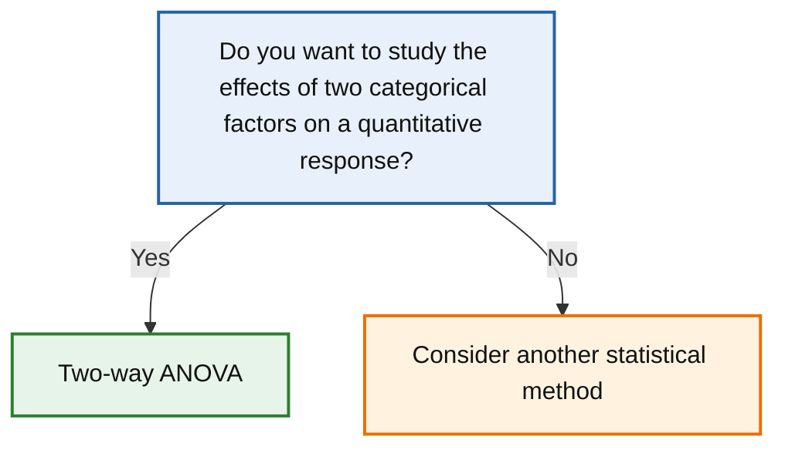

# Two-way ANOVA

← [Back to statistical method navigator](../index.md)

---



---

# Two-way ANOVA

## Quick answer

Use a **Two-way ANOVA** when you want to determine how **two categorical factors** influence a quantitative response variable.

Unlike a One-way ANOVA, this method evaluates:

- the effect of the first factor;
- the effect of the second factor;
- whether the two factors **interact**.

Typical questions include:

- Does teaching method affect exam scores?
- Does gender affect exam scores?
- Does the effect of the teaching method depend on gender?

The last question is known as an **interaction effect**, and it is the main reason for using a Two-way ANOVA.

---

# Research question

A Two-way ANOVA answers questions such as:

> **How do two categorical factors jointly influence a numerical response?**

Examples include:

- Does crop yield depend on both fertiliser type and irrigation method?
- Does blood pressure depend on both medication and exercise programme?
- Does customer satisfaction depend on both store location and delivery method?

Unlike the One-way ANOVA, this method can distinguish whether each factor has an effect on its own and whether the effect of one factor changes according to the level of the other.

---

# When should I use a Two-way ANOVA?

Use this method when:

- the response variable is quantitative;
- observations are independent;
- there are **two categorical explanatory variables**;
- each factor has two or more levels;
- the objective is to evaluate both factors simultaneously.

Examples:

| Factor A | Factor B | Response |
|-----------|-----------|----------|
| Teaching method | Gender | Exam score |
| Drug treatment | Exercise programme | Blood pressure |
| Fertiliser | Irrigation method | Crop yield |

---

# Decision checklist

Use a Two-way ANOVA if all the following are true:

- ✔ Quantitative response variable
- ✔ Independent observations
- ✔ Two categorical factors
- ✔ Two or more levels for each factor
- ✔ Interest in main effects and/or interaction

If only one categorical factor is present, use a **One-way ANOVA** instead.

---

# Conceptual idea

Suppose a university studies student performance.

Two factors are considered:

- Teaching method
- Gender

The response variable is the final exam score.

The research questions are:

- Does teaching method influence exam scores?
- Does gender influence exam scores?
- Does one teaching method benefit one gender more than the other?

The first two questions concern **main effects**.

The third concerns the **interaction** between the two factors.

---

# Understanding factors

A factor is a categorical explanatory variable.

For example,

Factor A:

Teaching method

- Traditional
- Online
- Hybrid

Factor B:

Gender

- Female
- Male

Every observation belongs to exactly one level of each factor.

---

# Main effects

A **main effect** measures the influence of one factor while averaging over the levels of the other factor.

For example,

Factor A:

Teaching method

asks

> Do different teaching methods produce different average scores regardless of gender?

Similarly,

Factor B asks

> Do males and females obtain different average scores regardless of teaching method?

These two questions are analysed independently.

---

# Interaction effect

The interaction is the defining feature of a Two-way ANOVA.

An interaction exists when

> **the effect of one factor depends on the level of the other factor.**

For example,

suppose the Online teaching method greatly improves the scores of female students,

but has little effect on male students.

In this situation,

the effectiveness of the teaching method depends on gender.

There is therefore an interaction between the two factors.

Without modelling the interaction,

this important relationship would remain hidden.

---

# Notation

Suppose

- Factor A has \(a\) levels;
- Factor B has \(b\) levels;
- each combination contains \(n\) observations.

Let

\[
\mu_{ij}
\]

denote the population mean corresponding to

- level \(i\) of Factor A;
- level \(j\) of Factor B.

The collection of all combinations is called a **factorial design**.

---

# Hypotheses

A Two-way ANOVA simultaneously evaluates three hypotheses.

## Main effect of Factor A

\[
H_0:
\text{All marginal means of Factor A are equal.}
\]

---

## Main effect of Factor B

\[
H_0:
\text{All marginal means of Factor B are equal.}
\]

---

## Interaction

\[
H_0:
\text{There is no interaction between Factors A and B.}
\]

Each hypothesis produces its own

- F statistic;
- p-value.

Consequently,

a Two-way ANOVA reports three statistical tests rather than one.

---

# Partitioning the variability

The total variability of the response variable is decomposed into four components:

- variability explained by Factor A;
- variability explained by Factor B;
- variability explained by the interaction;
- residual (within-cell) variability.

The F statistic is computed separately for each source of variation.

---

# Assumptions

Two-way ANOVA relies on the same assumptions as One-way ANOVA.

## 1. Independent observations

Observations must be independent.

Examples:

✔ different individuals

✔ different experimental units

✘ repeated measurements on the same participant

---

## 2. Quantitative response variable

The response variable should be continuous or approximately continuous.

Examples include:

- exam score;
- blood pressure;
- crop yield;
- reaction time.

---

## 3. Approximate normality

The response variable should be approximately normally distributed within each combination of factor levels.

Normality can be evaluated using:

- histograms;
- Q–Q plots;
- Shapiro–Wilk test.

---

## 4. Homogeneity of variances

Population variances should be approximately equal across all groups.

This assumption can be assessed using:

- Levene's test;
- Bartlett's test.

---

# What if the assumptions are violated?

## Mild departures from normality

Two-way ANOVA is generally robust when sample sizes are reasonably large and balanced.

---

## Unequal variances

Large differences in variances may invalidate the classical F tests.

Alternative modelling approaches or robust ANOVA procedures may be preferable.

---

## Severe non-normality

If assumptions are seriously violated,

consider suitable non-parametric or permutation-based methods.

---

## Significant interaction

When the interaction is statistically significant,

the interpretation of the main effects should be made with caution,

because the effect of one factor changes according to the level of the other factor.

---

# Python implementation

Python provides several ways to perform a Two-way ANOVA.

The most common approach uses the `statsmodels` library.

```python
import pandas as pd

from statsmodels.formula.api import ols
from statsmodels.stats.anova import anova_lm
```

The response variable and the two categorical factors are stored in a pandas DataFrame.

A linear model is then fitted using a formula.

---

# Worked example

Suppose a university investigates whether exam scores depend on

- teaching method;
- gender.

The dataset is organised as follows.

```python
import pandas as pd

data = pd.DataFrame({

    "score": [
        72,74,73,75,
        80,82,81,79,
        76,77,75,78,
        74,73,72,75,
        81,82,80,83,
        77,78,76,79
    ],

    "method": [
        "Traditional","Traditional","Traditional","Traditional",
        "Online","Online","Online","Online",
        "Hybrid","Hybrid","Hybrid","Hybrid",
        "Traditional","Traditional","Traditional","Traditional",
        "Online","Online","Online","Online",
        "Hybrid","Hybrid","Hybrid","Hybrid"
    ],

    "gender": [
        "Female","Female","Male","Male",
        "Female","Female","Male","Male",
        "Female","Female","Male","Male",
        "Female","Female","Male","Male",
        "Female","Female","Male","Male",
        "Female","Female","Male","Male"
    ]

})
```

---

# Fitting the model

The Two-way ANOVA is a particular case of a **linear model**.

Conceptually, the model can be written as

$$
Y_{ijk}
=
\mu
+
\alpha_i
+
\beta_j
+
(\alpha\beta)_{ij}
+
\varepsilon_{ijk}
$$

where

- \(Y_{ijk}\) is the observed response;
- \(\mu\) is the overall mean;
- \(\alpha_i\) is the effect of the \(i\)-th level of Factor A;
- \(\beta_j\) is the effect of the \(j\)-th level of Factor B;
- \((\alpha\beta)_{ij}\) is the interaction between the two factors;
- \(\varepsilon_{ijk}\) is the random error.

In our example,

- Factor A is the teaching method;
- Factor B is the student's gender.

The model therefore contains

- one intercept;
- one term for the teaching method;
- one term for gender;
- one interaction term.

In `statsmodels`, the same model is written as

```python
model = ols(

    "score ~ C(method) * C(gender)",

    data=data

).fit()
```

The operator

```text
*
```

is shorthand for

```text
C(method)
+
C(gender)
+
C(method):C(gender)
```

where

```text
:
```

represents the interaction between both factors.

Consequently, the model simultaneously estimates

- the main effect of the teaching method;
- the main effect of gender;
- the interaction between them.

---

# How categorical factors are represented

Unlike a linear regression,

the explanatory variables are categorical rather than numerical.

Before fitting the model,

`statsmodels` automatically converts every categorical factor into a set of **dummy (indicator) variables**.

For example,

```text
Teaching method

Traditional
Online
Hybrid
```

is internally encoded as

| Teaching method | Online | Hybrid |
|-----------------|-------:|-------:|
| Traditional | 0 | 0 |
| Online | 1 | 0 |
| Hybrid | 0 | 1 |

Notice that only two dummy variables are created.

The first category is used as the **reference level** and is omitted to avoid perfect multicollinearity (the **dummy variable trap**).

>By default, statsmodels uses treatment coding, taking the first category as the **reference level** and omitting its indicator variable to avoid the dummy variable trap. See Concepts → Dummy Variable Trap for a detailed discussion 

Similarly,

```text
Gender

Female
Male
```

becomes

| Gender | Male |
|---------|-----:|
| Female | 0 |
| Male | 1 |

After this encoding,

the statistical model is simply an ordinary linear regression with additional predictor variables.

The interaction term is then obtained by multiplying the corresponding dummy variables.

For this reason,

a Two-way ANOVA can be viewed as a linear regression model whose predictors happen to be categorical variables.

---

# Effect size

Statistical significance indicates whether an effect is likely to exist.

It does **not** indicate how important that effect is.

For a Two-way ANOVA, an effect size should be reported for

- Factor A;
- Factor B;
- the interaction.

One of the most common measures is **partial eta squared**.

---

# Partial eta squared

For each effect,

the partial eta squared is defined as

$$
\eta_p^2
=
\frac{SS_{Effect}}
{
SS_{Effect}
+
SS_{Error}
}
$$

where

- \(SS_{Effect}\) is the sum of squares for the factor or interaction;
- \(SS_{Error}\) is the residual sum of squares.

Unlike the eta squared used in a One-way ANOVA,

partial eta squared measures the proportion of variability explained by one effect after accounting for the remaining sources of variation.

Approximate interpretation:

| Partial η² | Interpretation |
|------------|----------------|
| 0.01 | Small |
| 0.06 | Medium |
| 0.14 | Large |

These thresholds should always be interpreted within the scientific context.

---

# Practical significance

Suppose the ANOVA table reports

```text
Factor A

F = 42.1

p < 0.001

Partial η² = 0.37
```

Factor A has both

- a statistically significant effect;
- a large practical effect.

Now suppose the interaction reports

```text
F = 1.12

p = 0.34

Partial η² = 0.01
```

There is little evidence that the influence of one factor depends on the other.

Reporting both statistical significance and effect size provides a much more informative interpretation than reporting the p-value alone.

---

# Complete reusable implementation

```python
import pandas as pd

from statsmodels.formula.api import ols
from statsmodels.stats.anova import anova_lm


def two_way_anova(
    data,
    response,
    factor_a,
    factor_b,
    typ=2
):
    """
    Perform a Two-way ANOVA.

    Parameters
    ----------
    data : pandas.DataFrame

    response : str

    factor_a : str

    factor_b : str

    typ : int
        Type of sums of squares.

    Returns
    -------
    pandas.DataFrame
    """

    formula = (
        f"{response} ~ "
        f"C({factor_a}) * C({factor_b})"
    )

    model = ols(
        formula,
        data=data
    ).fit()

    return anova_lm(
        model,
        typ=typ
    )
```

Example:

```python
results = two_way_anova(
    data,
    "score",
    "method",
    "gender"
)

print(results)
```

---

# Reporting template

A typical report might read:

> A Two-way ANOVA was conducted to evaluate the effects of teaching method and gender on exam scores. A significant main effect of teaching method was observed, *F*(2, 18) = 31.4, *p* < .001, whereas the main effect of gender was smaller, *F*(1, 18) = 4.9, *p* = .038. No statistically significant interaction between teaching method and gender was found, *F*(2, 18) = 0.82, *p* = .45.

Whenever possible,

also report an appropriate effect size.

---

# Common mistakes

## Ignoring the interaction

This is probably the most frequent mistake.

Many users immediately interpret the main effects without first checking whether the interaction is statistically significant.

Always examine the interaction first.

---

## Treating factors as numerical variables

Categorical predictors should always be specified as categorical variables.

In `statsmodels`, use

```python
C(variable)
```

rather than the raw variable name.

---

## Forgetting the reference level

Categorical variables are internally encoded using dummy variables.

One category is automatically chosen as the reference level.

Understanding this encoding helps interpret the estimated coefficients correctly.

---

## Unbalanced experimental designs

Unequal sample sizes do not invalidate a Two-way ANOVA,

but they require additional care.

Different types of sums of squares (Type I, II and III) may lead to different conclusions. See Concepts → Sums of Squares (Type I, II and III) for a detailed discussion of when each approach should be used.

Researchers should choose the appropriate type according to the experimental design.

---

## Interpreting significant main effects when the interaction is significant

A statistically significant interaction changes the interpretation of the entire model.

Simple effects and interaction plots should usually be examined before discussing the main effects.

---

# Comparison with related methods

| Situation | Recommended method |
|-----------|-------------------|
| One sample vs reference value | One-sample t-test |
| Two independent groups | Welch's t-test |
| Two paired measurements | Paired t-test |
| Three or more groups, one factor | One-way ANOVA |
| Three or more groups, two factors | **Two-way ANOVA** |
| Three or more groups with non-normal data | Kruskal–Wallis test |
| Quantitative predictors | Linear regression |

---

# Final decision rule

Use a **Two-way ANOVA** when

- the response variable is quantitative;
- observations are independent;
- there are two categorical explanatory variables;
- both factors have two or more levels;
- the objective is to evaluate their main effects and possible interaction.

Interpret the interaction first.

Only if the interaction is not statistically significant should the main effects be interpreted independently.

---

# Related methods

- One-way ANOVA
- Welch's ANOVA
- ANCOVA
- MANOVA
- Linear regression
- Kruskal–Wallis test

---

# References

- Fisher, R. A. (1925). *Statistical Methods for Research Workers*. Oliver & Boyd.
- Montgomery, D. C. (2020). *Design and Analysis of Experiments* (10th ed.). Wiley.
- Kutner, M. H., Nachtsheim, C. J., Neter, J., & Li, W. (2005). *Applied Linear Statistical Models* (5th ed.). McGraw-Hill.
- Rutherford, A. (2011). *ANOVA and ANCOVA: A GLM Approach* (2nd ed.). Wiley.
- Statsmodels Developers. *statsmodels.stats.anova.anova_lm*. https://www.statsmodels.org/
