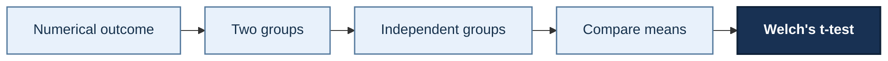

# Welch's t-test

**Level:** Beginner  
**Test family:** Parametric  
**Outcome variable:** Numerical  
**Group structure:** Two independent groups  
**Primary estimand:** Difference between two population means  

[← Return to the statistical test navigator](../index.md)

---

## Decision path

<div class="decision-path">


</div>

This path represents the decisions that lead to Welch's t-test:

1. The outcome variable is numerical.
2. There are two groups.
3. The groups are independent.
4. The research target is a difference between population means.
5. Equal population variances are not required.

!!! tip "Two ways to use this site"

    You can reach this page through the interactive decision diagram when
    you are unsure which test to use.

    You can also reach it through the book navigation when you already
    know that you want to consult Welch's t-test.

---

## Quick answer

Use Welch's t-test to compare the population means of two independent
groups when the outcome variable is numerical.

Welch's test does not require the two populations to have equal
variances and is generally preferable to Student's independent t-test
when equality of variances cannot be justified.

---

## What question does this test answer?

Welch's t-test answers questions such as:

> Is the population mean different between two independent groups?

For example:

> Is the mean completion time different between students following two
> different learning programmes?

The test can also answer directional questions:

> Is the population mean of group 1 greater than the population mean of
> group 2?

The direction must be defined before inspecting the results.

---

## When to use it

Use Welch's t-test when:

- the outcome variable is numerical;
- there are exactly two groups;
- the groups are independent;
- observations within each group are independent;
- the research target is a difference between population means;
- the sampling distribution of the difference in sample means is
  approximately normal;
- equal population variances cannot be assumed or have not been
  established.

---

## Decision checklist

Before using Welch's t-test, check the following:

- [ ] The outcome variable is numerical.
- [ ] There are two groups.
- [ ] The groups are independent.
- [ ] Each observation belongs to only one group.
- [ ] The target parameter is a difference between population means.
- [ ] Severe skewness or extreme outliers do not make the mean-based
      analysis misleading.
- [ ] A one-sided or two-sided hypothesis was chosen before examining the
      result.

If the same individuals are measured twice, use a
[paired t-test](paired-t-test.md) instead.

If the target concerns relative ranks or whether observations in one
group tend to be larger than those in another, consider the
Mann–Whitney U test *(coming soon)*

---

## Notation

Let:

- \(\mu_1\) be the population mean of group 1;
- \(\mu_2\) be the population mean of group 2;
- \(\bar{x}_1\) be the sample mean of group 1;
- \(\bar{x}_2\) be the sample mean of group 2;
- \(s_1^2\) be the sample variance of group 1;
- \(s_2^2\) be the sample variance of group 2;
- \(n_1\) be the sample size of group 1;
- \(n_2\) be the sample size of group 2.

Define the population mean difference as:

\[
\Delta = \mu_1-\mu_2
\]

The order of the groups matters, particularly for one-sided tests.

---

## Null and alternative hypotheses

### Two-sided test

Use a two-sided test when a difference in either direction is relevant.

\[
H_0:\mu_1=\mu_2
\]

\[
H_1:\mu_1\neq\mu_2
\]

Equivalently:

\[
H_0:\Delta=0
\]

\[
H_1:\Delta\neq0
\]

In SciPy:

```python
alternative="two-sided"
```

### One-sided test: group 1 has a greater mean

Use this formulation when the research hypothesis specifies in advance
that group 1 has a greater population mean.

\[
H_0:\mu_1\leq\mu_2
\]

\[
H_1:\mu_1>\mu_2
\]

Equivalently:

\[
H_0:\Delta\leq0
\]

\[
H_1:\Delta>0
\]

In SciPy:

```python
alternative="greater"
```

### One-sided test: group 1 has a lower mean

Use this formulation when the research hypothesis specifies in advance
that group 1 has a lower population mean.

\[
H_0:\mu_1\geq\mu_2
\]

\[
H_1:\mu_1<\mu_2
\]

Equivalently:

\[
H_0:\Delta\geq0
\]

\[
H_1:\Delta<0
\]

In SciPy:

```python
alternative="less"
```

!!! warning "Choose the direction before analysing the data"

    Do not choose a one-sided hypothesis after observing the sample means
    or the two-sided p-value.

    The direction must be determined by the research question before
    examining the result.

---

## Test statistic

Welch's test statistic is:

\[
t =
\frac{
\bar{x}_1-\bar{x}_2
}{
\sqrt{
\frac{s_1^2}{n_1}
+
\frac{s_2^2}{n_2}
}
}
\]

The denominator is the estimated standard error of the difference
between the two sample means:

\[
SE(\bar{x}_1-\bar{x}_2)
=
\sqrt{
\frac{s_1^2}{n_1}
+
\frac{s_2^2}{n_2}
}
\]

The statistic expresses the observed difference between the sample means
in units of its estimated standard error.

- A positive \(t\)-value indicates that \(\bar{x}_1>\bar{x}_2\).
- A negative \(t\)-value indicates that \(\bar{x}_1<\bar{x}_2\).
- Larger absolute values of \(t\) provide stronger evidence against the
  equality null hypothesis.

The approximate degrees of freedom are calculated using the
Welch–Satterthwaite equation:

\[
\nu =
\frac{
\left(
\frac{s_1^2}{n_1}
+
\frac{s_2^2}{n_2}
\right)^2
}{
\frac{
\left(\frac{s_1^2}{n_1}\right)^2
}{
n_1-1
}
+
\frac{
\left(\frac{s_2^2}{n_2}\right)^2
}{
n_2-1
}
}
\]

The resulting degrees of freedom do not need to be an integer.

---

## Assumptions and checks

Welch's t-test assumes that:

- the two samples are independent;
- observations within each sample are independent;
- the outcome variable is numerical;
- the sampling distribution of the difference between the sample means
  is approximately normal;
- the samples are representative of the populations of interest;
- extreme outliers do not dominate the sample means.

Equal population variances are **not** required.

\[
\sigma_1^2 = \sigma_2^2
\]

is not an assumption of Welch's t-test.

### Inspecting the data

Before running the test, inspect:

- sample sizes;
- missing values;
- summary statistics;
- histograms or density plots;
- boxplots;
- skewness;
- possible extreme outliers.

!!! note "Perfectly normal raw data are not required"

    The relevant condition concerns the sampling distribution of the
    difference between sample means.

    With sufficiently large samples, moderate departures from normality
    are often tolerable. Small samples combined with severe skewness or
    extreme outliers require greater caution.

---

## What if the assumptions are not met?

The appropriate alternative depends on which assumption fails and on the
research question.

### The observations are paired

Use a [paired t-test](paired-t-test.md).

Examples include:

- before-and-after measurements from the same participants;
- matched pairs;
- repeated measurements on the same units.

### The outcome is severely non-normal

If the samples are small and the data show severe skewness or influential
outliers, consider the
Mann–Whitney U test *(coming soon)*

Mann–Whitney U is a rank-based test for two independent groups.

!!! warning "Mann–Whitney U is not generally a test of equal means"

    Mann–Whitney U evaluates whether observations from one population
    tend to be larger or smaller than observations from the other.

    It should not automatically be described as a test of equal means or
    equal medians.

    An interpretation in terms of medians requires additional assumptions
    about the shapes and spreads of the two distributions.

### The target remains the difference in means

If the research target is specifically:

\[
\mu_1-\mu_2
\]

but the parametric approximation is questionable, consider a permutation
test for the difference in means.

A useful decision rule is:

- use **Welch's t-test** when the target is the population mean difference
  and its assumptions are sufficiently reasonable;
- use **Mann–Whitney U** when the question concerns relative ordering or
  distributional differences;
- use a **permutation test of the mean difference** when the target remains
  the difference in means but the parametric approximation is unsuitable.

---

## Python implementation

```python
from scipy.stats import ttest_ind

result = ttest_ind(
    group_1,
    group_2,
    equal_var=False,
    nan_policy="omit",
    alternative="two-sided"
)

print(f"Statistic: {result.statistic:.3f}")
print(f"Degrees of freedom: {result.df:.2f}")
print(f"P-value: {result.pvalue:.4f}")
```

Setting:

```python
equal_var=False
```

selects Welch's t-test rather than Student's equal-variance independent
t-test.

The `alternative` argument can be:

```python
alternative="two-sided"
alternative="greater"
alternative="less"
```

The alternatives are interpreted in terms of the first sample relative
to the second sample.

```python
ttest_ind(
    group_1,
    group_2,
    equal_var=False,
    alternative="greater"
)
```

tests whether the population mean associated with `group_1` is greater
than the population mean associated with `group_2`.

---

## Worked example

Suppose we want to compare task completion times between two independent
groups.

```python
import numpy as np
from scipy.stats import ttest_ind

method_a = np.array([
    42, 39, 45, 41, 38, 44, 40, 43, 47, 39
])

method_b = np.array([
    36, 35, 40, 34, 38, 37, 33, 39, 35, 36
])

result = ttest_ind(
    method_a,
    method_b,
    equal_var=False,
    alternative="two-sided"
)

mean_a = method_a.mean()
mean_b = method_b.mean()
mean_difference = mean_a - mean_b

print(f"Mean of method A: {mean_a:.2f}")
print(f"Mean of method B: {mean_b:.2f}")
print(f"Mean difference: {mean_difference:.2f}")
print(f"Statistic: {result.statistic:.3f}")
print(f"Degrees of freedom: {result.df:.2f}")
print(f"P-value: {result.pvalue:.4f}")
```

The result should be interpreted together with:

- the group means;
- the mean difference;
- the confidence interval;
- the effect size;
- the research context.

A small p-value alone does not tell us whether the difference is
practically important.

---

## Interpretation

Choose a significance level before performing the test, commonly:

\[
\alpha=0.05
\]

If:

\[
p<\alpha
\]

reject \(H_0\) and conclude that the data provide evidence in favour of
the specified alternative hypothesis.

If:

\[
p\geq\alpha
\]

do not reject \(H_0\).

A non-significant result does not prove that the two population means are
equal. It means that the data do not provide sufficient evidence to
reject the null hypothesis at the selected significance level.

Statistical significance should always be interpreted alongside the
estimated difference, confidence interval and effect size.

---

## Confidence interval

For a two-sided test, report a confidence interval for:

\[
\mu_1-\mu_2
\]

SciPy can calculate it directly:

```python
result = ttest_ind(
    group_1,
    group_2,
    equal_var=False,
    nan_policy="omit",
    alternative="two-sided"
)

confidence_interval = result.confidence_interval(
    confidence_level=0.95
)

print(confidence_interval)
```

A two-sided \(95\%\) confidence interval that does not contain zero
corresponds to rejecting:

\[
H_0:\mu_1-\mu_2=0
\]

at:

\[
\alpha=0.05
\]

The interval communicates both:

- the direction of the estimated difference;
- the uncertainty around its magnitude.

---

## Effect size

The p-value describes evidence against the null hypothesis. It does not
measure the magnitude of the difference.

For two independent groups, a standardised mean difference can be
reported.

Because Welch's test allows unequal variances, the choice of
standardisation should be stated explicitly.

One possible descriptive standardisation is:

\[
d_{\text{av}}
=
\frac{
\bar{x}_1-\bar{x}_2
}{
\sqrt{
\frac{s_1^2+s_2^2}{2}
}
}
\]

This divides the mean difference by the square root of the average of
the two sample variances.

```python
import numpy as np

mean_difference = group_1.mean() - group_2.mean()

average_sd = np.sqrt(
    (
        group_1.var(ddof=1)
        +
        group_2.var(ddof=1)
    )
    / 2
)

d_av = mean_difference / average_sd

print(f"Standardised mean difference: {d_av:.3f}")
```

The raw mean difference should still be reported because it remains in
the original measurement units and is often easier to interpret.

---

## What to report

A complete report should include:

- the sample size of each group;
- the mean and standard deviation of each group;
- the estimated difference between means;
- the Welch \(t\)-statistic;
- the approximate degrees of freedom;
- the p-value;
- a confidence interval for the mean difference;
- an effect-size estimate;
- whether the test was one-sided or two-sided.

Example:

> Group 1 had a higher mean score than group 2. Welch's t-test provided
> evidence of a difference between the population means,
> \(t(16.84)=2.73\), \(p=0.014\). The estimated mean difference was
> \(4.80\), with a 95% confidence interval of \([1.08,8.52]\).

Replace the numbers with the actual results from the analysis.

---

## Common mistakes

- Using an independent test when the observations are paired.
- Treating `greater` or `less` as referring to the second sample.
- Reversing the sample order without changing the hypothesis.
- Choosing a one-sided test after inspecting the data.
- Reporting only the p-value.
- Assuming a non-significant result proves equality.
- Confusing statistical significance with practical importance.
- Automatically interpreting Mann–Whitney U as a test of equal means.
- Ignoring severe skewness or influential outliers in small samples.
- Running a preliminary equal-variance test and selecting between
  Student's and Welch's tests based only on its p-value.
- Forgetting that Welch's test already allows unequal variances.

---

## Related methods

### Different data structure

- [Paired t-test](paired-t-test.md): two related or paired measurements.
- [One-way ANOVA](one-way-anova.md): more than two independent groups.
- Welch's ANOVA: *(comming soon)*

### Non-parametric or resampling alternatives

- Mann–Whitney U test *(coming soon)* 
- Permutation test for two independent means: *(coming soon)*

### Statistical concepts

- Null and alternative hypotheses: *(../concepts/hypotheses.md)*
- P-values: *(../concepts/p-values.md)*
- Confidence intervals: *(../concepts/confidence-intervals.md)*
- Effect sizes: *(../concepts/effect-sizes.md)*

---

## Navigation

[← Return to the statistical test navigator](../index.md)

Continue with:

- Mann–Whitney U test *(coming soon)* 
- [Paired t-test →](paired-t-test.md)
